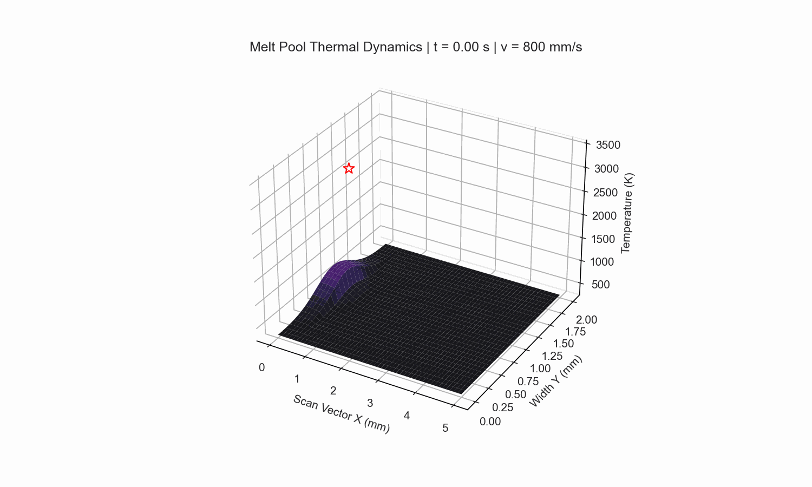
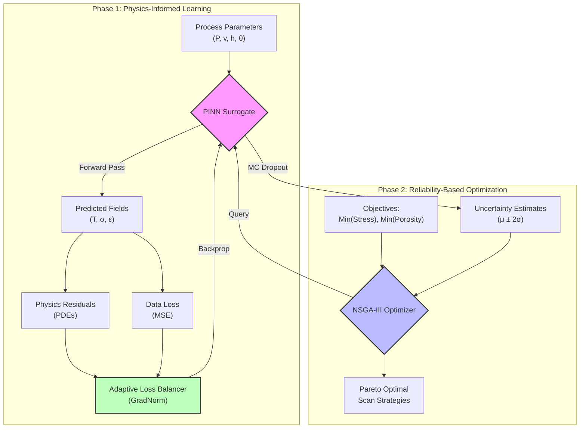
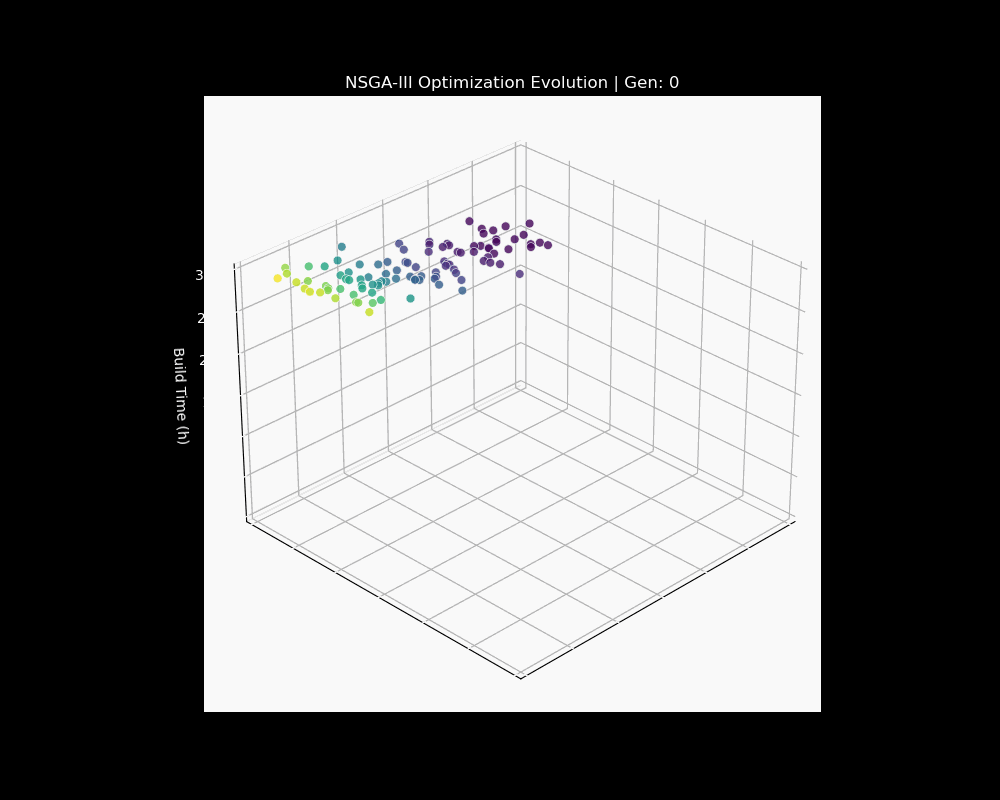
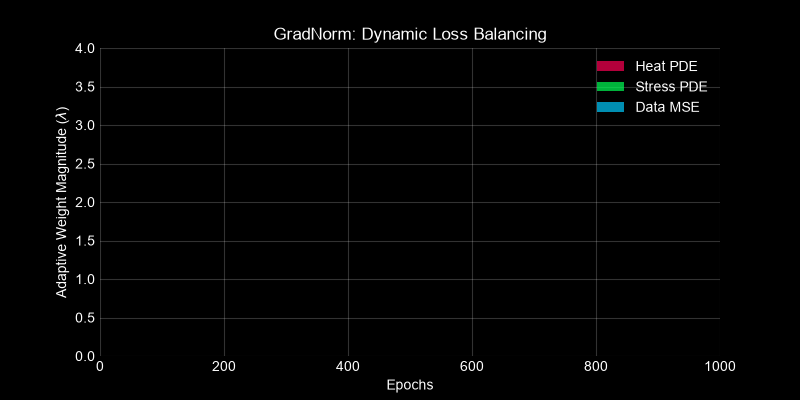
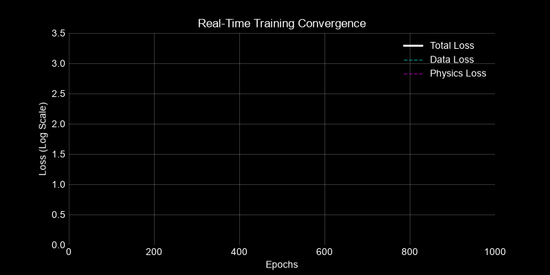

# LPBF-Optimizer: Physics-Informed Digital Twin for Additive Manufacturing


> **A Framework for Multi-Objective & Reliability-Based Optimization in Laser Powder Bed Fusion (LPBF)**

---

## 🔬 Scientific Abstract

The **LPBF-Optimizer** addresses the fundamental inverse problem in metal additive manufacturing: *determining optimal process parameters to guarantee material performance*. By coupling **Physics-Informed Neural Networks (PINNs)** with **Multi-Objective Evolutionary Algorithms (NSGA-III)**, we establish a differentiable "Digital Twin" of the melt pool dynamics.

This framework transcends traditional black-box surrogate modeling by enforcing thermodynamic consistency via partial differential equations (PDEs), specifically the transient heat conduction equation and quasi-static solid mechanics. It features research-grade implementations of **Uncertainty Quantification** (Gal & Ghahramani, 2016) and **Adaptive Loss Balancing** (Wang et al., 2021), ensuring predictions are not only accurate but confidence-calibrated for high-stakes aerospace and biomedical applications.


*Figure 1: Real-time simulation of melt pool thermal evolution generated by the Digital Twin.*

---

## 🧠 Core Architecture & Methodology

The system replaces computationally prohibitive Finite Element Analysis (FEA) with a high-speed neural surrogate.



### Physics-Informed Loss Function

We solve the coupled multi-physics system by minimizing a composite loss function $\mathcal{L}$:

$$
\mathcal{L} = \lambda_{data}\mathcal{L}_{data} + \lambda_{heat}\mathcal{L}_{heat} + \lambda_{stress}\mathcal{L}_{stress}
$$

Where the heat residual $\mathcal{L}_{heat}$ enforces energy conservation:
$$
\rho c_p \frac{\partial T}{\partial t} - \nabla \cdot (k \nabla T) = \frac{2\eta P}{\pi r_0^2} \exp\left(\frac{-2r^2}{r_0^2}\right) - \mathcal{L}_{latent}
$$

---

## 🚀 Research-Grade Features

### 1. Reliability-Based Optimization (NSGA-III)
>
> [!TIP]
> **See the optimizer in action:** The population evolves from random initialization to a structured 3D Pareto Front, balancing **Stress**, **Porosity**, and **Build Time**.


*Figure 2: 3D Animation of the NSGA-III population converging towards the optimal Pareto surface.*

### 2. Adaptive Loss Balancing (GradNorm)
>
> [!IMPORTANT]
> Multi-physics training is prone to **Gradient Pathology**, where one physical constraint dominates the optimization landscape.

We implement a dynamic weighting scheme (Wang et al., 2021) that normalizes gradient magnitudes in real-time. This ensures balanced convergence across thermal and mechanical domains.


*Figure 3: Dynamic evolution of loss weights ($\lambda$) during training. Note how the weights (y-axis) adjust autonomously to balance the competing PDEs.*

### 3. Uncertainty Quantification (MC Dropout)
>
> [!NOTE]
> Reliability is paramount. Predictions include epistemic uncertainty bounds ($\mu \pm 2\sigma$).

We utilize **Monte Carlo Dropout** (Gal & Ghahramani, 2016) to approximate the Bayesian posterior.


*Figure 4: Real-time training convergence. The **Physics Loss** (magenta) and **Data Loss** (cyan) are minimized simultaneously.*

---

## 📂 Project Structure & Key Files

| Module | File Link | Description |
| :--- | :--- | :--- |
| **Neural Core** | [`src/pinn/model.py`](src/pinn/model.py) | The `PINN` architecture with MC Dropout layers. |
| **Physics** | [`src/pinn/physics.py`](src/pinn/physics.py) | Differentiable PDE definitions for heat & stress. |
| **Balancing** | [`src/pinn/loss_balancer.py`](src/pinn/loss_balancer.py) | The `AdaptiveLossBalancer` class implementing GradNorm. |
| **Optimization** | [`src/optimiser/nsga3.py`](src/optimiser/nsga3.py) | Multi-objective genetic algorithm engine. |
| **Roadmap** | [`todo.md`](todo.md) | **Development Roadmap** and future research directions (3D Sim phase). |
| **Config** | [`data/params.yaml`](data/params.yaml) | Centralized configuration for physics & ML hyperparameters. |

> [!TIP]
> Check `todo.md` for our detailed roadmap towards **Phase 5: 3D Microstructure Simulation**.

---

## 📚 References

1. **Gal, Y., & Ghahramani, Z. (2016).** *Dropout as a Bayesian Approximation*. ICML.
2. **Wang, S., Teng, Y., & Perdikaris, P. (2021).** *Understanding and mitigating gradient flow pathologies*. SIAM.
3. **Zhao, Mirihanage, et al. (2025).** *Revealing melt flow instabilities in LPBF*.
4. **Deb, K., & Jain, H. (2014).** *An Evolutionary Many-Objective Optimization Algorithm*. IEEE.

---

## 🛠️ Getting Started

### Prerequisites

* **OS**: Windows, Linux, or macOS
* **Python**: 3.10 or 3.11 (Recommended)
* **Hardware**: NVIDIA GPU (Optional but recommended for >10x speedup)

### 📦 Installation Guide

We strongly recommend using **Conda** to manage dependencies and avoid system conflicts.

#### Option A: Conda (Recommended)

1. **Create a fresh environment**:

    ```bash
    conda create -n lpbf-opt python=3.11
    conda activate lpbf-opt
    ```

2. **Clone the repository**:

    ```bash
    git clone https://github.com/llMr-Sweetll/lpbf-optimizer.git
    cd lpbf-optimizer
    ```

3. **Install Dependencies**:

    ```bash
    pip install -r requirements.txt
    ```

#### Option B: Standard Python (Pip)

```bash
git clone https://github.com/llMr-Sweetll/lpbf-optimizer.git
cd lpbf-optimizer
python -m venv venv
# Windows:
.\venv\Scripts\activate
# Linux/Mac:
source venv/bin/activate
pip install -r requirements.txt
```

---

### ⚠️ Common Troubleshooting (Click to Expand)

<details>
<summary><strong>Issue: OMP: Error #15: Initializing libiomp5md.dll</strong></summary>

* **Cause**: Conflict between PyTorch and NumPy OpenMP libraries on Windows.
* **Fix**: This project automatically handles this by setting `KMP_DUPLICATE_LIB_OK=TRUE` internally. If you still see this, run:

    ```bash
    set KMP_DUPLICATE_LIB_OK=TRUE
    ```

</details>

<details>
<summary><strong>Issue: CUDA out of memory</strong></summary>

* **Fix**: Reduce batch size in `data/params.yaml`:

    ```yaml
    training:
      batch_size: 2048  # Try reducing to 1024 or 512
    ```

</details>

---

### 🏃‍♂️ Quick Start Workflow

#### 1. Train the Digital Twin

This typically takes 5-10 minutes on a GPU. It will generate a model checkpoint in `data/models/`.

```bash
python src/pinn/train.py --config data/params.yaml
```

#### 2. Optimize Parameters

Once the model is trained, use the genetic algorithm to find optimal scan strategies.

```bash
# Note: Replace 'latest' with specific timestamp folder if needed
python src/optimiser/nsga3.py --config data/params.yaml --model data/models/latest/checkpoints/best_model.pt
```

#### 3. Visualize Results

Check the `data/models/latest/plots/` directory. You will find:

* `loss_curves.png`: Scientific proof of convergence.
* `adaptive_weights.png`: Dynamic balancing of physics vs. data.
* `pareto_front.png`: The trade-off between speed and quality.

---
*Developed for Advanced Manufacturing Research.*
