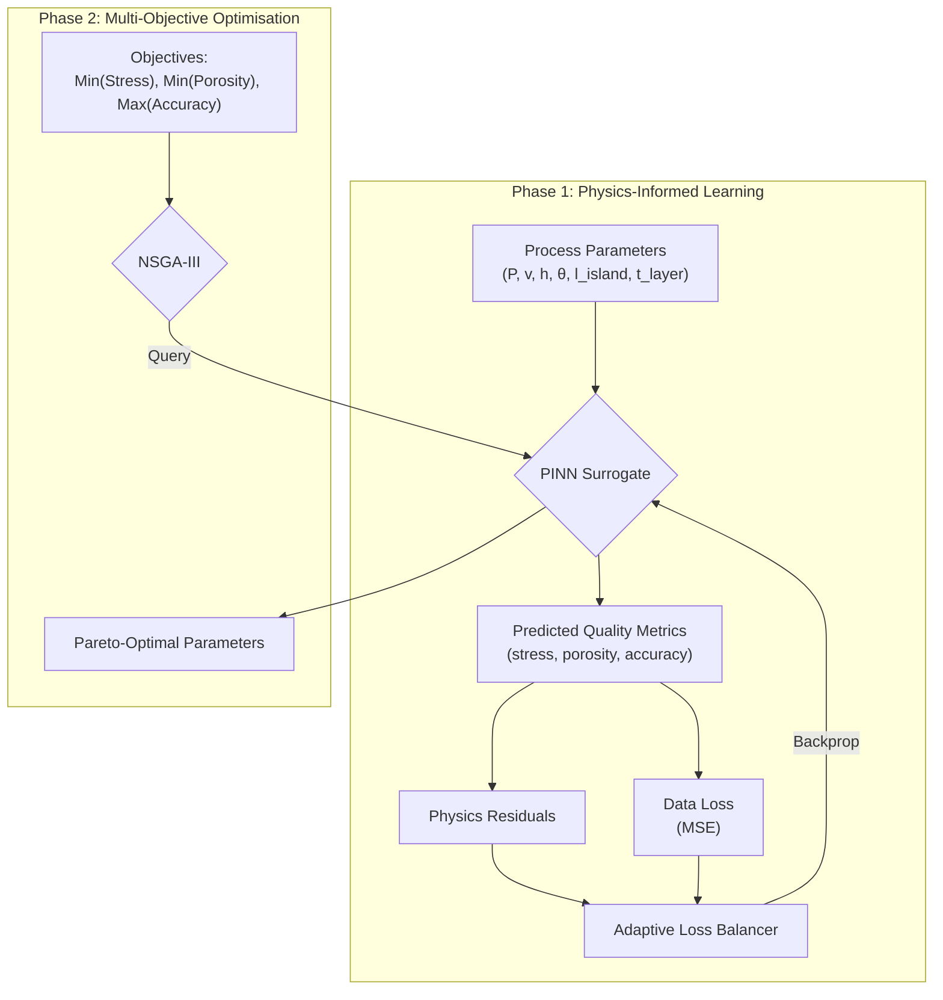

# LPBF-Optimizer: Physics-Informed Digital Twin for Additive Manufacturing


> **A Framework for Multi-Objective Optimisation in Laser Powder Bed Fusion (LPBF)**

---

## Scientific Abstract

**LPBF-Optimizer** couples a Physics-Informed Neural Network (PINN) surrogate with multi-objective evolutionary optimisation (NSGA-III) to map LPBF process parameters to part-quality metrics: residual stress, porosity, and geometric accuracy. The PINN is regularised by physics-informed residuals derived from an analytic temperature field and the predicted quality metrics, reducing reliance on large experimental or FEA datasets.

The framework includes research-grade implementations of Monte-Carlo Dropout for uncertainty quantification (Gal & Ghahramani, 2016) and GradNorm-style adaptive loss balancing (Wang et al., 2021).

---

## Core Architecture



### Loss Function

$$
\mathcal{L} = \lambda_{data}\mathcal{L}_{data} + \lambda_{heat}\mathcal{L}_{heat} + \lambda_{stress}\mathcal{L}_{stress} + \lambda_{porosity}\mathcal{L}_{porosity} + \lambda_{geometry}\mathcal{L}_{geometry}
$$

---

## Project Structure

| Module | File | Description |
| :--- | :--- | :--- |
| PINN | [`src/pinn/model.py`](src/pinn/model.py) | Network architecture with MC Dropout. |
| Physics | [`src/pinn/physics.py`](src/pinn/physics.py) | Physics-informed residuals. |
| Training | [`src/pinn/train.py`](src/pinn/train.py) | Training loop and checkpointing. |
| Optimisation | [`src/optimiser/nsga3.py`](src/optimiser/nsga3.py) | NSGA-III Pareto front. |
| Bayes Opt | [`src/optimiser/bayesopt.py`](src/optimiser/bayesopt.py) | Single-objective Bayesian optimisation. |
| Config | [`data/params.yaml`](data/params.yaml) | Centralised parameters. |

> **Note:** Validation modules (`src/validate/`) are stubs that document how real machine interfaces would be wired in. They are safe to run only in `dry_run=True` mode.

---

## Getting Started

### Prerequisites

- Python 3.10 or 3.11
- (Optional) NVIDIA GPU with CUDA

### Installation

```bash
git clone https://github.com/llMr-Sweetll/lpbf-optimizer.git
cd lpbf-optimizer
python -m venv venv
source venv/bin/activate  # Windows: .\venv\Scripts\activate
pip install -r requirements.txt
```

### Quick Start

```bash
# 1. Generate synthetic training data
python src/generate_synthetic_data.py --config data/params.yaml --scan-vectors 50 --points-per-vector 64

# 2. Train the PINN
python src/pinn/train.py --config data/params.yaml

# 3. Run NSGA-III optimisation
python src/optimiser/nsga3.py --config data/params.yaml --model data/models/latest/checkpoints/best_model.pt
```

Outputs:
- `data/processed/lpbf_dataset.h5`
- `data/models/latest/checkpoints/best_model.pt`
- `data/optimized/pareto_solutions.csv`

### Running Tests

```bash
pytest
```

---

## Troubleshooting

**OMP: Error #15 (Windows):**  
The trainer sets `KMP_DUPLICATE_LIB_OK=TRUE`. If the error persists, run:

```bash
set KMP_DUPLICATE_LIB_OK=TRUE
```

**CUDA out of memory:**  
Reduce `batch_size` in `data/params.yaml`.

---

## References

1. Gal, Y., & Ghahramani, Z. (2016). *Dropout as a Bayesian Approximation*. ICML.
2. Wang, S., Teng, Y., & Perdikaris, P. (2021). *Understanding and mitigating gradient flow pathologies*. SIAM.
3. Deb, K., & Jain, H. (2014). *An Evolutionary Many-Objective Optimization Algorithm*. IEEE.

---

## License

MIT — see [`LICENSE`](LICENSE).

*Developed for Advanced Manufacturing Research.*
