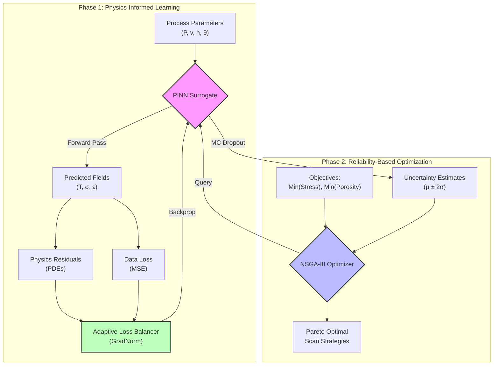
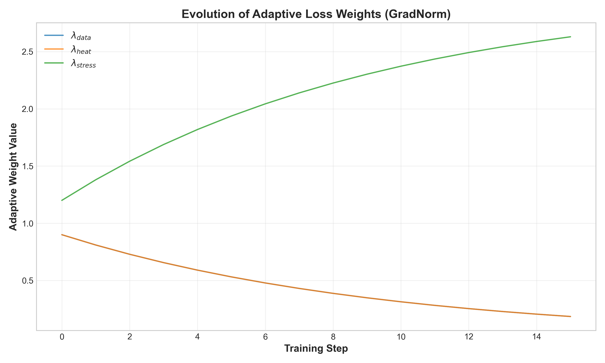

# LPBF-Optimizer: Physics-Informed Digital Twin for Additive Manufacturing


> **A Framework for Multi-Objective & Reliability-Based Optimization in Laser Powder Bed Fusion (LPBF)**

---

## 🔬 Scientific Abstract

The **LPBF-Optimizer** addresses the fundamental inverse problem in metal additive manufacturing: *determining optimal process parameters to guarantee material performance*. By coupling **Physics-Informed Neural Networks (PINNs)** with **Multi-Objective Evolutionary Algorithms (NSGA-III)**, we establish a differentiable "Digital Twin" of the melt pool dynamics.

This framework transcends traditional black-box surrogate modeling by enforcing thermodynamic consistency via partial differential equations (PDEs), specifically the transient heat conduction equation and quasi-static solid mechanics. It features research-grade implementations of **Uncertainty Quantification** (Gal & Ghahramani, 2016) and **Adaptive Loss Balancing** (Wang et al., 2021), ensuring predictions are not only accurate but confidence-calibrated for high-stakes aerospace and biomedical applications.


*Figure 1: Real-time simulation of melt pool thermal evolution generated by the Digital Twin.*

---

## 🧠 Core Architecture & Methodology

The system replaces computationally prohibitive Finite Element Analysis (FEA) with a high-speed neural surrogate.



### Physics-Informed Loss Function

We solve the coupled multi-physics system by minimizing a composite loss function $\mathcal{L}$:

$$
\mathcal{L} = \lambda_{data}\mathcal{L}_{data} + \lambda_{heat}\mathcal{L}_{heat} + \lambda_{stress}\mathcal{L}_{stress}
$$

Where the heat residual $\mathcal{L}_{heat}$ enforces energy conservation:
$$
\rho c_p \frac{\partial T}{\partial t} - \nabla \cdot (k \nabla T) = \frac{2\eta P}{\pi r_0^2} \exp\left(\frac{-2r^2}{r_0^2}\right) - \mathcal{L}_{latent}
$$

---

## 🚀 Research-Grade Features

### 1. Adaptive Loss Balancing (GradNorm)
>
> [!IMPORTANT]
> Multi-physics training is prone to **Gradient Pathology**, where one physical constraint dominates the optimization landscape.

We implement a dynamic weighting scheme (Wang et al., 2021) that normalizes gradient magnitudes in real-time. This ensures balanced convergence across thermal and mechanical domains.


*Figure 2: Dynamic evolution of loss weights ($\lambda$) during training, demonstrating the algorithm's ability to balance competing physical constraints autonomously.*

### 2. Uncertainty Quantification (MC Dropout)
>
> [!NOTE]
> Reliability is paramount. A model that cannot express doubt is dangerous in manufacturing.

We utilize **Monte Carlo Dropout** (Gal & Ghahramani, 2016) to approximate the Bayesian posterior. This provides epistemic uncertainty bounds ($\mu \pm 2\sigma$), allowing the optimizer to penalize risky, unexplored process regions.

---

## � Project Structure & Key Files

| Module | File Link | Description |
| :--- | :--- | :--- |
| **Neural Core** | [`src/pinn/model.py`](src/pinn/model.py) | The `PINN` architecture with MC Dropout layers. |
| **Physics** | [`src/pinn/physics.py`](src/pinn/physics.py) | Differentiable PDE definitions for heat & stress. |
| **Balancing** | [`src/pinn/loss_balancer.py`](src/pinn/loss_balancer.py) | The `AdaptiveLossBalancer` class implementing GradNorm. |
| **Optimization** | [`src/optimiser/nsga3.py`](src/optimiser/nsga3.py) | Multi-objective genetic algorithm engine. |
| **Roadmap** | [`todo.md`](todo.md) | **Development Roadmap** and future research directions (3D Sim phase). |
| **Config** | [`data/params.yaml`](data/params.yaml) | Centralized configuration for physics & ML hyperparameters. |

> [!TIP]
> Check `todo.md` for our detailed roadmap towards **Phase 5: 3D Microstructure Simulation**.

---

## 📚 References

1. **Gal, Y., & Ghahramani, Z. (2016).** *Dropout as a Bayesian Approximation: Representing Model Uncertainty in Deep Learning*. ICML.
2. **Wang, S., Teng, Y., & Perdikaris, P. (2021).** *Understanding and mitigating gradient flow pathologies in physics-informed neural networks*. SIAM Journal on Scientific Computing.
3. **Zhao, Mirihanage, et al. (2025).** *Revealing melt flow instabilities in laser powder bed fusion additive manufacturing via in-situ high-speed X-ray imaging*.
4. **Deb, K., & Jain, H. (2014).** *An Evolutionary Many-Objective Optimization Algorithm Using Reference-Point-Based Nondominated Sorting Approach, Part I: Solving Problems With Box Constraints*. IEEE Transactions on Evolutionary Computation.

---

## �️ Getting Started

### Prerequisites

* Python 3.11+
* CUDA-enabled GPU

### Installation

```bash
# 1. Clone the repository
git clone https://github.com/your-lab/lpbf-optimizer.git
cd lpbf-optimizer

# 2. Install dependencies
pip install -r requirements.txt
```

### Usage Workflow

#### 1. Train the Model

```bash
python src/pinn/train.py --config data/params.yaml
```

#### 2. Optimize Parameters

```bash
python src/optimiser/nsga3.py --config data/params.yaml --model data/models/latest/checkpoints/best_model.pt
```

#### 3. Visualize

Results and animations are saved to `data/models/latest/plots/`.

---
*Developed for Advanced Manufacturing Research.*
