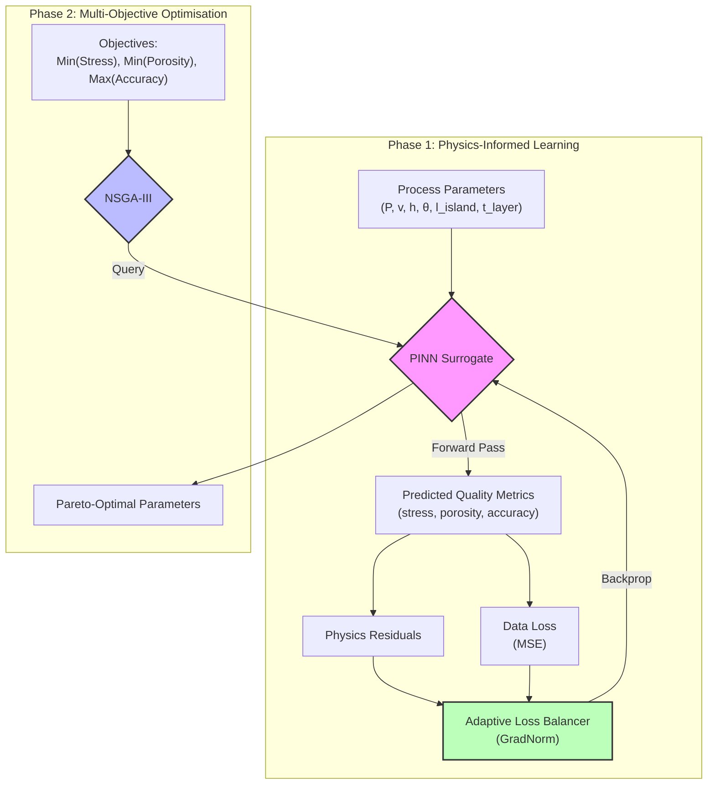
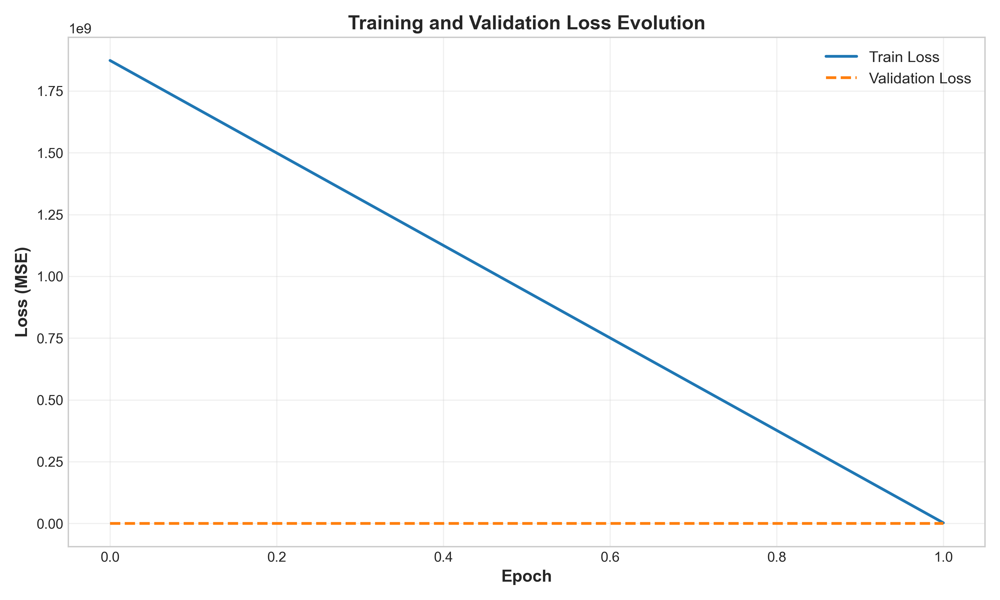
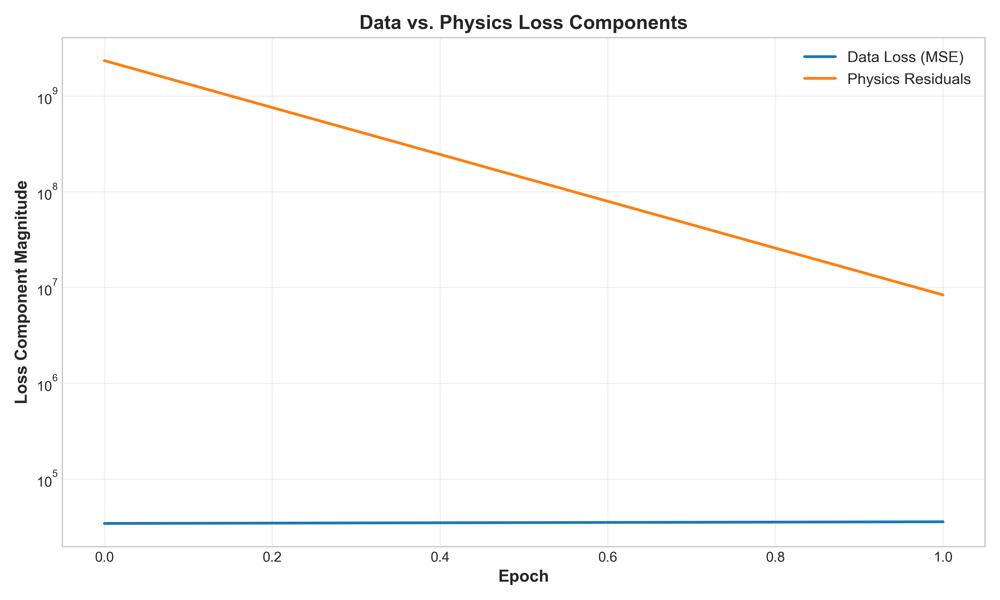
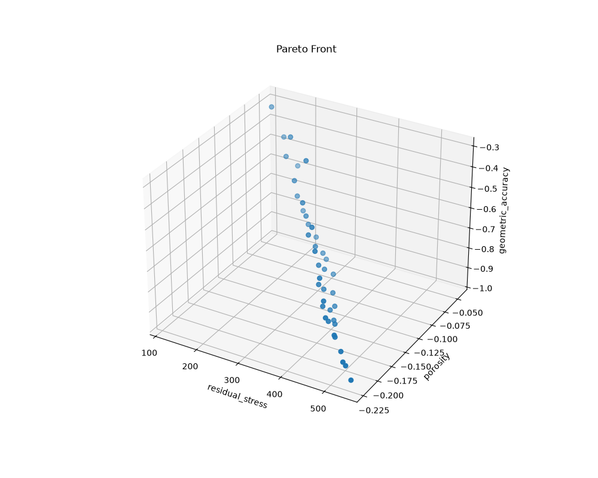

# LPBF-Optimizer: Physics-Informed Digital Twin for Additive Manufacturing


[](https://github.com/llMr-Sweetll/lpbf-optimizer/actions/workflows/ci.yml)
[](https://github.com/llMr-Sweetll/lpbf-optimizer/releases/latest)
[](https://github.com/llMr-Sweetll/lpbf-optimizer/pkgs/container/lpbf-optimizer)
[](https://pypi.org/project/lpbf-optimizer/)

> **A Framework for Multi-Objective Optimisation in Laser Powder Bed Fusion (LPBF)**

---

## 📑 Table of Contents

- [Scientific Abstract](#scientific-abstract)
- [Core Architecture & Methodology](#core-architecture--methodology)
- [Research-Grade Features](#research-grade-features)
- [Real Results from the Default Workflow](#real-results-from-the-default-workflow)
- [Gallery](#gallery)
- [Project Structure & Key Files](#project-structure--key-files)
- [References](#references)
- [Getting Started](#getting-started)
- [Documentation](#documentation)
  - [Notebook Walkthroughs](#notebook-walkthroughs)
- [Roadmap & Contributing](#roadmap--contributing)
- [Benchmarks](#benchmarks)
- [Citation](#citation)
- [License](#license)
- [Author](#llmr-sweetll)

---

## 🔬 Scientific Abstract

**LPBF-Optimizer** addresses the inverse problem in metal additive manufacturing: *determining optimal process parameters to guarantee part quality*. By coupling a **Physics-Informed Neural Network (PINN)** surrogate with **multi-objective evolutionary optimisation (NSGA-III)**, the framework maps LPBF process settings to three quality metrics:

- **Residual stress** (MPa) — minimise
- **Porosity** (%) — minimise
- **Geometric accuracy** (ratio) — maximise

The PINN is regularised by physics-informed residuals derived from an analytic temperature field and the predicted quality metrics, reducing reliance on large experimental or FEA datasets. The framework also features **Monte-Carlo Dropout** for uncertainty quantification (Gal & Ghahramani, 2016) and **GradNorm-style adaptive loss balancing** (Wang et al., 2021).


*Figure 1: Illustrative melt-pool thermal dynamics generated by `src/vis/animate_training.py`.*

---

## 🧠 Core Architecture & Methodology

The system replaces computationally expensive Finite Element Analysis (FEA) with a high-speed neural surrogate.



### Physics-Informed Loss Function

We minimise a composite loss that balances data fidelity and physics-informed regularisation:

$$
\mathcal{L} = \lambda_{data}\mathcal{L}_{data} + \lambda_{heat}\mathcal{L}_{heat} + \lambda_{stress}\mathcal{L}_{stress} + \lambda_{porosity}\mathcal{L}_{porosity} + \lambda_{geometry}\mathcal{L}_{geometry}
$$

---

## 🚀 Research-Grade Features

### 1. Multi-Objective Optimisation (NSGA-III)

> [!TIP]
> The optimiser evolves a population towards a structured 3D Pareto front balancing **stress**, **porosity**, and **geometric accuracy**.


*Figure 2: Illustrative NSGA-III evolution animation generated by `src/vis/animate_optimization.py`.*

### 2. Adaptive Loss Balancing (GradNorm)

> [!IMPORTANT]
> Multi-physics training is prone to **gradient pathology**, where one loss component dominates the landscape.

A dynamic weighting scheme normalises gradient magnitudes in real time, ensuring balanced convergence across thermal, mechanical, porosity, and geometry terms.


*Figure 3: Illustrative GradNorm weight evolution generated by `src/vis/animate_training_metrics.py`.*

### 3. Uncertainty Quantification (MC Dropout)

> [!NOTE]
> Predictions include epistemic uncertainty bounds via **Monte Carlo Dropout** (Gal & Ghahramani, 2016).


*Figure 4: Illustrative training convergence animation generated by `src/vis/animate_training_metrics.py`.*

---

## 📊 Real Results from the Default Workflow

After running the Quick Start commands below, the repository produces the following artefacts:

| Plot | Description |
|------|-------------|
|  | Training and validation loss evolution from the latest run. |
|  | Data loss vs. physics residual components. |
|  | GradNorm adaptive weights over training steps. |
|  | 3D Pareto front discovered by NSGA-III. |

*Note: The GIFs above are illustrative demos; the static PNGs are produced by the actual training and optimisation scripts.*

---

## 🎨 Gallery

A few visual highlights from the framework — generated by the scripts in `src/vis/`.

<p align="center">
  
  &nbsp;
  
</p>

<p align="center">
  
  &nbsp;
  
</p>

Run `python src/vis/animate_optimization.py` or `python src/vis/animate_training.py` to regenerate them.

---

## 📂 Project Structure & Key Files

| Module | File | Description |
| :--- | :--- | :--- |
| **Neural Core** | [`src/pinn/model.py`](src/pinn/model.py) | The `PINN` architecture with MC Dropout layers. |
| **Physics** | [`src/pinn/physics.py`](src/pinn/physics.py) | Physics-informed residuals aligned with quality-metric outputs. |
| **Balancing** | [`src/pinn/loss_balancer.py`](src/pinn/loss_balancer.py) | The `AdaptiveLossBalancer` class implementing GradNorm. |
| **Training** | [`src/pinn/train.py`](src/pinn/train.py) | Training loop, checkpointing, and metric plotting. |
| **Optimisation** | [`src/optimiser/nsga3.py`](src/optimiser/nsga3.py) | Multi-objective NSGA-III engine. |
| **Bayes Opt** | [`src/optimiser/bayesopt.py`](src/optimiser/bayesopt.py) | Single-objective Bayesian optimisation with Ax/BoTorch. |
| **Roadmap** | [`todo.md`](todo.md) | Development roadmap towards Phase 5. |
| **Config** | [`data/params.yaml`](data/params.yaml) | Centralised configuration for physics & ML hyperparameters. |

> [!TIP]
> Check `todo.md` for the detailed roadmap towards **Phase 5: 3D Microstructure Simulation**.

> [!NOTE]
> Validation modules (`src/validate/`) are stubs that document how real machine interfaces would be wired in. Run them only in `dry_run=True` mode.

---

## 📚 References

1. **Gal, Y., & Ghahramani, Z. (2016).** *Dropout as a Bayesian Approximation*. ICML.
2. **Wang, S., Teng, Y., & Perdikaris, P. (2021).** *Understanding and mitigating gradient flow pathologies*. SIAM.
3. **Deb, K., & Jain, H. (2014).** *An Evolutionary Many-Objective Optimization Algorithm*. IEEE.

---

## 🛠️ Getting Started

### Prerequisites

* **OS**: Windows, Linux, or macOS
* **Python**: 3.10 or 3.11 (Recommended)
* **Hardware**: NVIDIA GPU (Optional but recommended for >10x speedup)

### 📦 Installation Guide

We strongly recommend using **Conda** to manage dependencies and avoid system conflicts.

#### Option A: Conda (Recommended)

1. **Create a fresh environment**:

    ```bash
    conda env create -f environment.yml
    conda activate lpbf-opt
    ```

2. **Clone the repository**:

    ```bash
    git clone https://github.com/llMr-Sweetll/lpbf-optimizer.git
    cd lpbf-optimizer
    ```

#### Option B: Standard Python (Pip)

```bash
git clone https://github.com/llMr-Sweetll/lpbf-optimizer.git
cd lpbf-optimizer
python -m venv venv
# Windows:
.\venv\Scripts\activate
# Linux/Mac:
source venv/bin/activate
pip install -r requirements.txt
```

---

### ⚠️ Common Troubleshooting

#### Issue: OMP: Error #15: Initializing libiomp5md.dll

* **Cause**: Conflict between PyTorch and NumPy OpenMP libraries on Windows.
* **Fix**: The trainer sets `KMP_DUPLICATE_LIB_OK=TRUE`. If the error persists, run:

    ```bash
    set KMP_DUPLICATE_LIB_OK=TRUE
    ```

#### Issue: CUDA out of memory

* **Fix**: Reduce `batch_size` in `data/params.yaml`:

    ```yaml
    training:
      batch_size: 32  # Try reducing to 16 or 8
    ```

---

### 🏃‍♂️ Quick Start Workflow

#### 1. Generate Synthetic Training Data

```bash
python src/generate_synthetic_data.py --config data/params.yaml --scan-vectors 50 --points-per-vector 64
```

#### 2. Train the Digital Twin

This typically takes 5–10 minutes on a CPU for the default 50 epochs.

```bash
python src/pinn/train.py --config data/params.yaml
```

#### 3. Optimise Parameters

Once the model is trained, run NSGA-III to find Pareto-optimal scan strategies. `geometric_accuracy` is maximised internally.

```bash
python src/optimiser/nsga3.py --config data/params.yaml --model data/models/latest/checkpoints/best_model.pt
```

#### 4. Run Tests

```bash
pytest
```

#### 5. Visualise Results

Check the generated outputs:

* `data/models/latest/plots/loss_curves.png`
* `data/models/latest/plots/adaptive_weights.png`
* `data/optimized/pareto_front_3d.png`
* `data/optimized/pareto_solutions.csv`

You can also regenerate the illustrative GIFs:

```bash
python src/vis/animate_training.py
python src/vis/animate_optimization.py
python src/vis/animate_training_metrics.py
```

---

## 📚 Documentation

- [`docs/research/literature-survey.md`](docs/research/literature-survey.md) — comprehensive literature survey on PINNs, uncertainty quantification, multi-objective Bayesian optimisation, digital twins, and CFD/grain-structure coupling for LPBF.
- [`docs/references.bib`](docs/references.bib) — BibTeX references for the literature survey.
- [`docs/adr/`](docs/adr/) — Architecture Decision Records.
- [`docs/scientific_workflow.md`](docs/scientific_workflow.md) — end-to-end scientific workflow.
- [`docs/contributing-physics-residual.md`](docs/contributing-physics-residual.md) — guide for adding new physics residuals.
- [`CONTRIBUTING.md`](CONTRIBUTING.md) — contributor guidelines.

### 📓 Notebook Walkthroughs

A set of self-contained Jupyter notebooks demonstrates the complete workflow using small, fast parameters and only synthetic data (no external FEA licences required). Run them in order:

1. [`notebooks/01_data_generation.ipynb`](notebooks/01_data_generation.ipynb) — generate a synthetic LPBF dataset with `SyntheticDataGenerator` and optionally inspect `LPBFDataPreprocessor`.
2. [`notebooks/02_training.ipynb`](notebooks/02_training.ipynb) — train the `PINNTrainer` for a few quick epochs and evaluate on the test set.
3. [`notebooks/03_optimisation.ipynb`](notebooks/03_optimisation.ipynb) — run a short NSGA-III Pareto search and an optional Bayesian single-objective optimisation with the trained checkpoint.
4. [`notebooks/04_visualisation.ipynb`](notebooks/04_visualisation.ipynb) — generate the illustrative animation GIFs and a static plot of the discovered Pareto front.

To execute a notebook from the command line:

```bash
cd notebooks
jupyter nbconvert --execute --inplace 01_data_generation.ipynb
```

---

## 🗺️ Roadmap & Contributing

LPBF-Optimizer is actively maintained. The high-level roadmap lives in [`todo.md`](todo.md) and is tracked through GitHub Issues:

- [Open issues](https://github.com/llMr-Sweetll/lpbf-optimizer/issues)
- [Latest release](https://github.com/llMr-Sweetll/lpbf-optimizer/releases/latest)
- [Container images](https://github.com/llMr-Sweetll/lpbf-optimizer/pkgs/container/lpbf-optimizer)

Recent milestones in **v0.2.0**:

- Leakage-free scan-vector data splits
- Input normalisation, physical output bounds, and physics ablation studies
- Expanded literature survey with a 40-reference BibTeX file
- Automated CI/CD release pipeline and Docker image publication

See [`CONTRIBUTING.md`](CONTRIBUTING.md) for setup, coding style, and how to open pull requests.

---

## ⚡ Benchmarks

The default quick workflow runs end-to-end on CPU in under 5 seconds. Results below are from `scripts/benchmark.py` running on **Apple Silicon** (`cpu`) with PyTorch 2.12.1.

| Stage | Metric | Value |
|---|---|---|
| **Overall** | Total runtime | **2.89 s** |
| **Data generation** | Runtime | 0.02 s |
| | Scan vectors | 20 |
| | Points per vector | 64 |
| **Training** | Runtime | 2.09 s |
| | Epochs | 5 |
| | Final validation loss | **0.00189** |
| | Best validation loss | **0.001498** |
| **Optimisation** | Runtime | 0.78 s |
| | Generations | 5 |
| | Pareto solutions | 13 |

Run the benchmark yourself with:

```bash
python scripts/benchmark.py --mode quick
```

A longer, more statistically meaningful run is available via `--mode standard` (or `--mode full` for the full sweep).

---

## 📖 Citation

If you use **LPBF-Optimizer** in your research, publications, conference papers, or technical reports, please cite it as follows:

**Author:** Chandrashekhar Hegde — [](https://orcid.org/0000-0002-8294-7657)

### BibTeX

```bibtex
@software{hegde2026lpbfoptimizer,
  author = {Hegde, Chandrashekhar},
  title = {{LPBF-Optimizer}: Physics-Informed Digital Twin for Additive Manufacturing},
  year = {2026},
  url = {https://github.com/llMr-Sweetll/lpbf-optimizer},
  version = {0.2.0},
  note = {Research prototype}
}
```

### APA

Hegde, C. (2026). *LPBF-Optimizer: Physics-Informed Digital Twin for Additive Manufacturing* (Version 0.2.0) [Computer software]. https://github.com/llMr-Sweetll/lpbf-optimizer

### IEEE

C. Hegde, “LPBF-Optimizer: Physics-Informed Digital Twin for Additive Manufacturing,” 2026. [Online]. Available: https://github.com/llMr-Sweetll/lpbf-optimizer

---

## 📄 License

MIT — see [`LICENSE`](LICENSE).

---

<div align="center">

## llMr-Sweetll

*AI for Advanced Manufacturing | Digital Twins | Optimisation*

[](https://github.com/llMr-Sweetll)
[](https://www.linkedin.com/in/hegdechandrashekhar/)
[](mailto:hegde.g.chandrashekhar@gmail.com)

**Interests**:

`Physics-Informed ML` • `Multi-Objective Optimization` • `Additive Manufacturing` • `Computational Materials Science`

> **"Optimizing the future of manufacturing, one melt pool at a time."**

</div>

---

