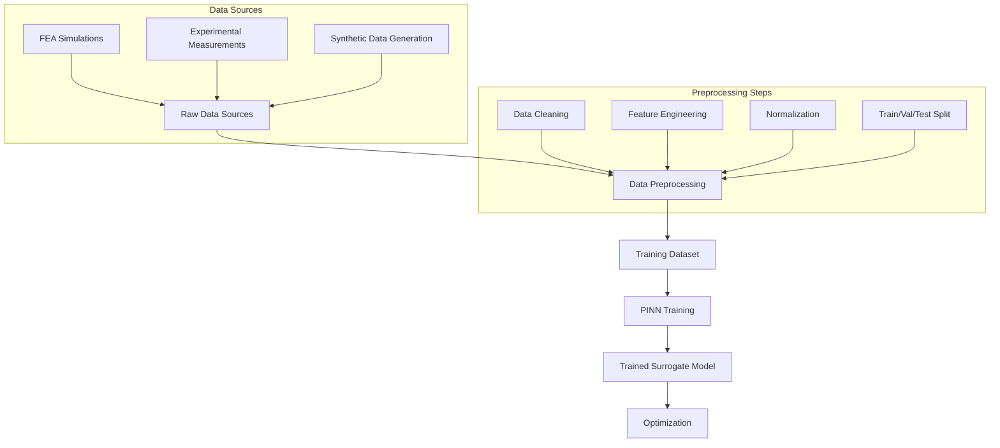
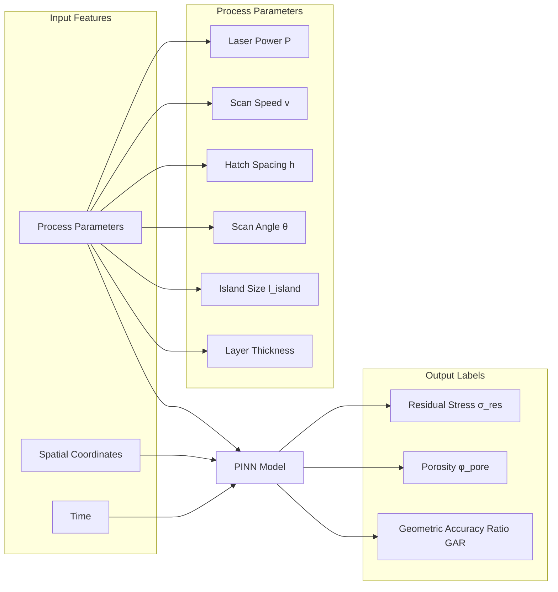
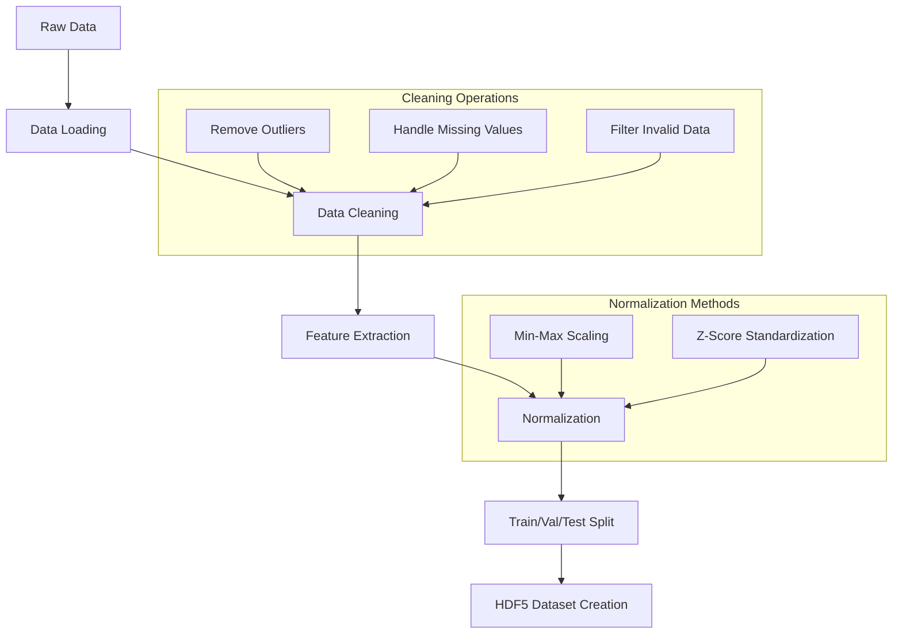
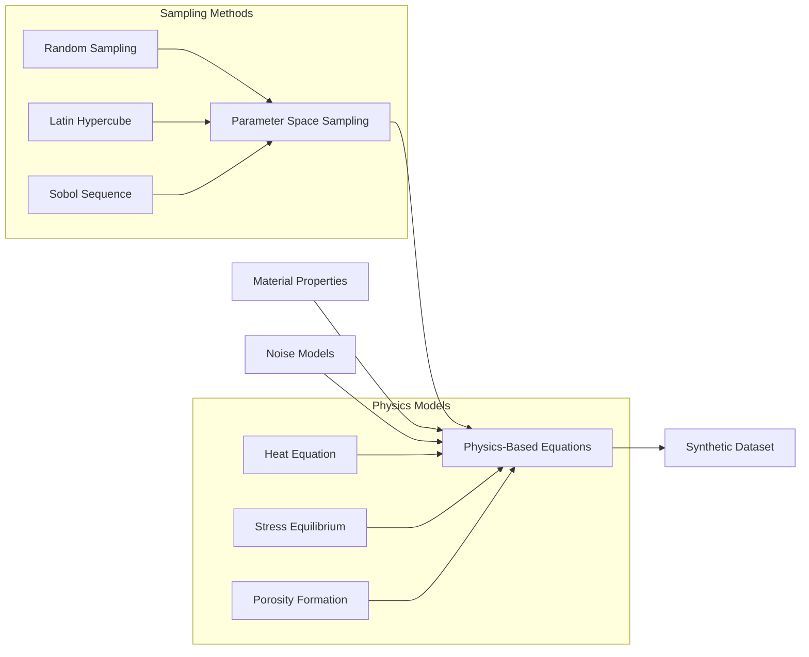
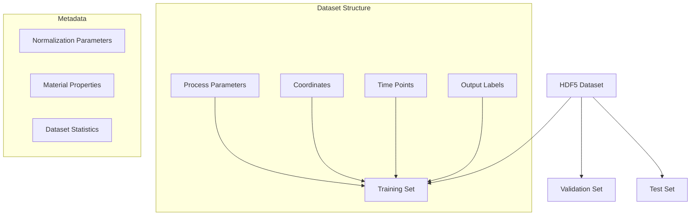
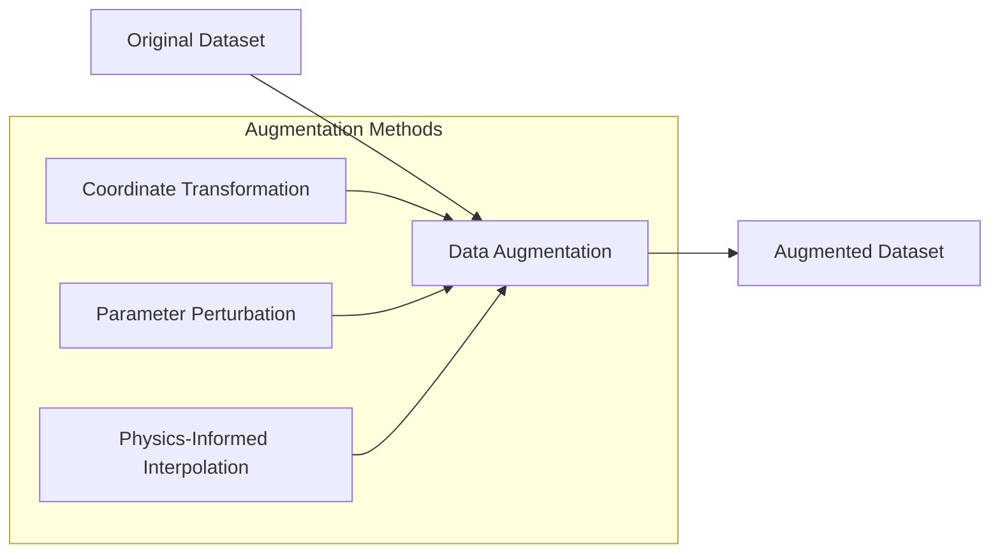

# LPBF Data Processing Workflow

This document provides flowcharts and explanations of the data processing pipeline in the LPBF optimization framework.

## Overall Data Flow

## Data Structure

## Data Preprocessing Pipeline

## Synthetic Data Generation

## Data Storage Format

## Data Augmentation Techniques

