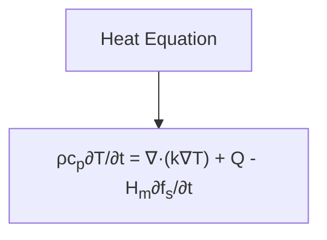

# LPBF Equations Reference

This document provides a comprehensive reference for the key equations used in the LPBF optimization framework.

## Heat Transfer Equations

### Heat Equation with Moving Laser Source

The heat equation describes the temperature evolution in the material during the LPBF process:

$$\rho c_p \frac{\partial T}{\partial t} = \nabla \cdot (k \nabla T) + Q - H_m \frac{\partial f_s}{\partial t}$$

Where:

- $\rho$ = Density (kg/m³)
- $c_p$ = Specific heat capacity (J/kg·K)
- $T$ = Temperature (K)
- $t$ = Time (s)
- $k$ = Thermal conductivity (W/m·K)
- $Q$ = Heat source term (W/m³)
- $H_m$ = Latent heat of melting (J/kg)
- $f_s$ = Solid fraction (dimensionless)

### Gaussian Laser Heat Source

The laser heat source is modeled as a Gaussian distribution:

$$Q = \frac{2\eta P}{\pi r_0^2} \exp\left(-\frac{2r^2}{r_0^2}\right)$$

Where:

- $\eta$ = Laser absorption coefficient
- $P$ = Laser power (W)
- $r_0$ = Laser beam radius (mm)
- $r$ = Distance from laser center (mm)

### Solid Fraction Model

The solid fraction is modeled using a smooth function based on temperature:

$$f_s = \frac{1}{2} \left(1 + \tanh\left(\frac{T_l - T}{T_l - T_s} \cdot 10\right)\right)$$

Where:

- $T_s$ = Solidus temperature (K)
- $T_l$ = Liquidus temperature (K)

## Mechanical Equations

### Static Equilibrium

The static equilibrium equation for stress:

$$\nabla \cdot \sigma = 0$$

Where:

- $\sigma$ = Stress tensor (Pa)

### Constitutive Equation

The relationship between stress and elastic strain:

$$\sigma = C : \varepsilon^e$$

Where:

- $C$ = Elasticity tensor (Pa)
- $\varepsilon^e$ = Elastic strain tensor

### Strain Decomposition

Total strain is decomposed into elastic, plastic, and thermal components:

$$\varepsilon = \varepsilon^e + \varepsilon^p + \varepsilon^{th}$$

Where:

- $\varepsilon$ = Total strain
- $\varepsilon^e$ = Elastic strain
- $\varepsilon^p$ = Plastic strain
- $\varepsilon^{th}$ = Thermal strain

### Thermal Strain

$$\varepsilon^{th} = \alpha (T - T_0) I$$

Where:

- $\alpha$ = Thermal expansion coefficient (1/K)
- $T_0$ = Reference temperature (K)
- $I$ = Identity tensor

### Plastic Flow Rule

$$\dot{\varepsilon}^p = A\left(\frac{\sigma_{eq}}{\sigma_y}\right)^n$$

Where:

- $\dot{\varepsilon}^p$ = Plastic strain rate
- $A$, $n$ = Material constants
- $\sigma_{eq}$ = Equivalent (von Mises) stress (Pa)
- $\sigma_y$ = Yield strength (Pa)

## PINN Loss Functions

### Total Loss

$$L_{total} = L_{data} + \lambda_{heat} L_{heat} + \lambda_{stress} L_{stress}$$

Where:

- $L_{data}$ = Data-driven loss
- $L_{heat}$ = Heat equation physics loss
- $L_{stress}$ = Stress equilibrium physics loss
- $\lambda_{heat}$, $\lambda_{stress}$ = Weighting factors

### Data Loss

$$L_{data} = \frac{1}{N} \sum_{i=1}^{N} \left[ (\sigma_{res,i} - \hat{\sigma}_{res,i})^2 + (\phi_{pore,i} - \hat{\phi}_{pore,i})^2 + (GAR_i - \widehat{GAR}_i)^2 \right]$$

Where:

- $\sigma_{res}$ = Residual stress
- $\phi_{pore}$ = Porosity
- $GAR$ = Geometric accuracy ratio
- Hat symbols (^) denote predicted values

### Physics Loss

$$L_{heat} = \frac{1}{N} \sum_{i=1}^{N} \left| \rho c_p \frac{\partial T_i}{\partial t} - \nabla \cdot (k \nabla T_i) - Q_i + H_m \frac{\partial f_{s,i}}{\partial t} \right|^2$$

$$L_{stress} = \frac{1}{N} \sum_{i=1}^{N} \left| \nabla \cdot \sigma_i \right|^2$$

## Optimization Metrics

### Energy Density

Volumetric energy density is a key process metric:

$$E = \frac{P}{v \cdot h \cdot t}$$

Where:

- $E$ = Volumetric energy density (J/mm³)
- $P$ = Laser power (W)
- $v$ = Scan speed (mm/s)
- $h$ = Hatch spacing (mm)
- $t$ = Layer thickness (mm)

### Porosity Model

Porosity can be related to energy density through empirical models:

$$\phi_{pore} = a \cdot \exp(-b \cdot E) + c \cdot \exp(d \cdot E)$$

Where $a$, $b$, $c$, $d$ are fitting parameters that capture both lack-of-fusion porosity (at low energy) and keyhole porosity (at high energy).

### Residual Stress Approximation

A simplified relationship between residual stress and cooling rate:

$$\sigma_{res} \propto \frac{\partial T}{\partial t} \cdot \frac{E \cdot \alpha}{1-\nu}$$

Where:

- $E$ = Young's modulus (Pa)
- $\alpha$ = Thermal expansion coefficient (1/K)
- $\nu$ = Poisson's ratio

### Geometric Accuracy Ratio

$$GAR = 1 - \frac{|d_{actual} - d_{nominal}|}{d_{nominal}}$$

Where:

- $d_{actual}$ = Actual dimension
- $d_{nominal}$ = Nominal (designed) dimension