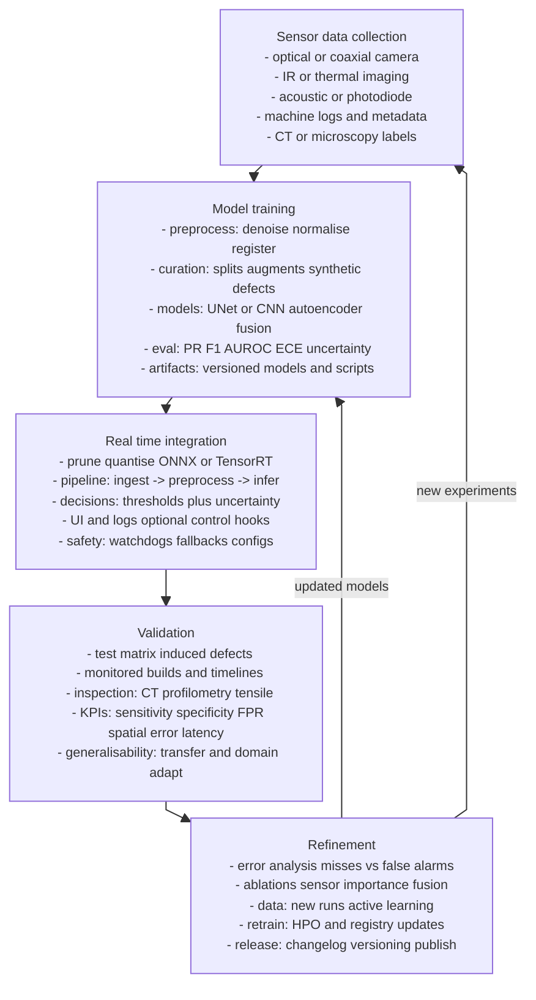

```mermaid

%%{init: {"flowchart":{"curve":"linear","nodeSpacing":12,"rankSpacing":14}, "themeVariables":{"fontSize":"11px"}}}%%
flowchart TB
  A["Sensor data collection
  - optical or coaxial camera
  - IR or thermal imaging
  - acoustic or photodiode
  - machine logs and metadata
  - CT or microscopy labels"] -->
  B["Model training
  - preprocess: denoise normalise register
  - curation: splits augments synthetic defects
  - models: UNet or CNN autoencoder fusion
  - eval: PR F1 AUROC ECE uncertainty
  - artifacts: versioned models and scripts"] -->
  C["Real time integration
  - prune quantise ONNX or TensorRT
  - pipeline: ingest -> preprocess -> infer
  - decisions: thresholds plus uncertainty
  - UI and logs optional control hooks
  - safety: watchdogs fallbacks configs"] -->
  D["Validation
  - test matrix induced defects
  - monitored builds and timelines
  - inspection: CT profilometry tensile
  - KPIs: sensitivity specificity FPR spatial error latency
  - generalisability: transfer and domain adapt"] -->
  E["Refinement
  - error analysis misses vs false alarms
  - ablations sensor importance fusion
  - data: new runs active learning
  - retrain: HPO and registry updates
  - release: changelog versioning publish"]

  E -- "updated models" --> B
  E -- "new experiments" --> A


```
