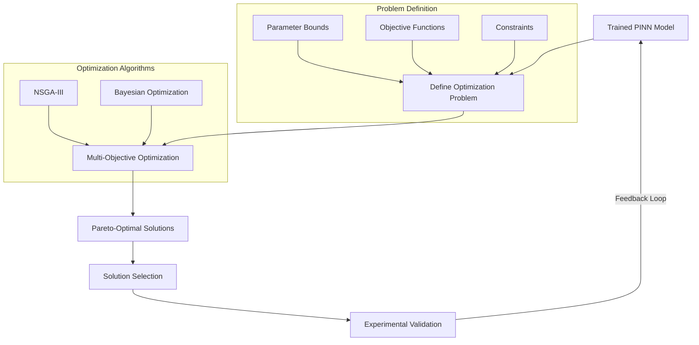
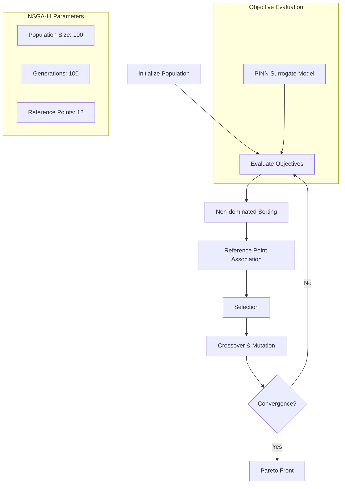
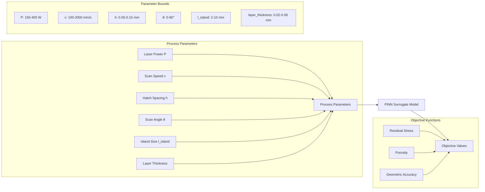
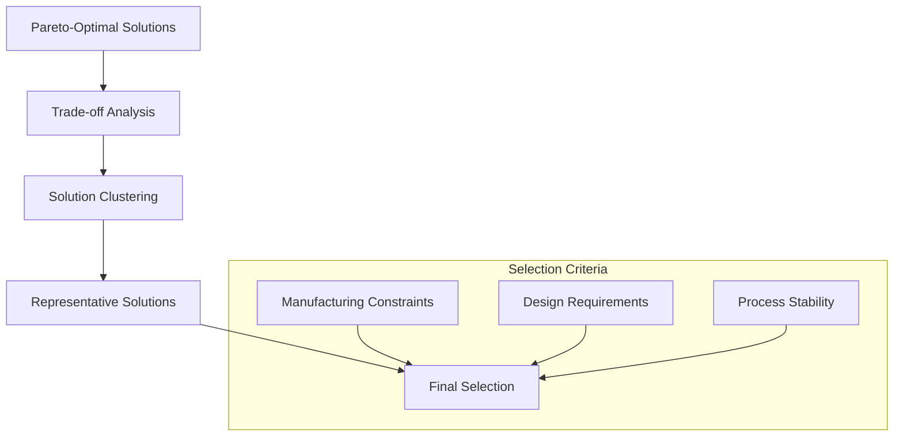
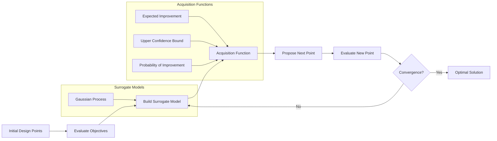
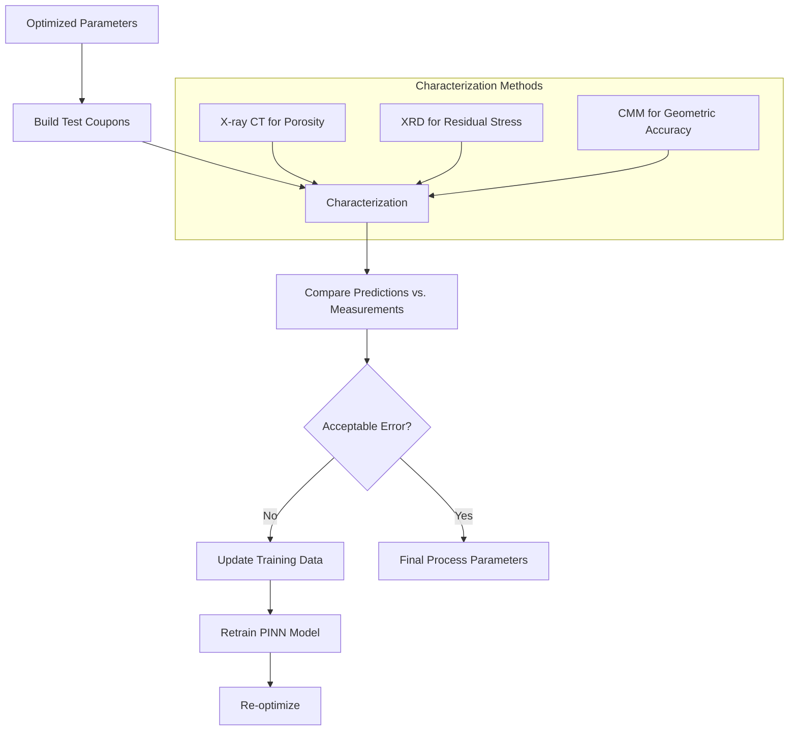

# LPBF Optimization Workflow

This document provides flowcharts and explanations of the optimization process in the LPBF framework, showing how optimal process parameters are determined.

## Overall Optimization Workflow

## Multi-Objective Optimization with NSGA-III

## Surrogate Problem Definition

## Pareto Front Analysis

## Bayesian Optimization Alternative

## Experimental Validation Loop

