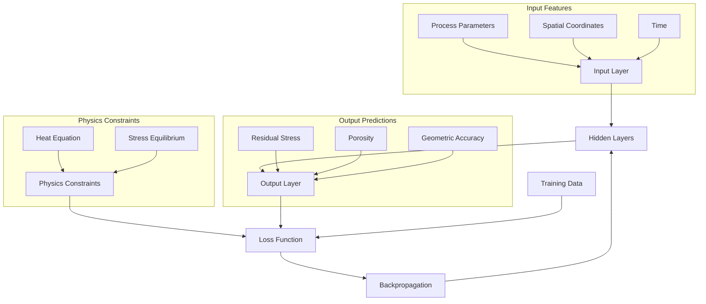
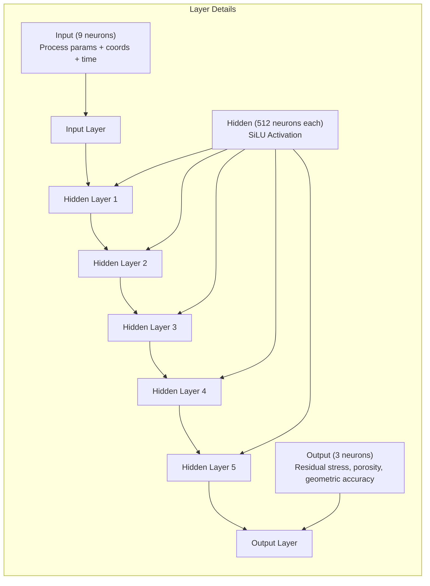
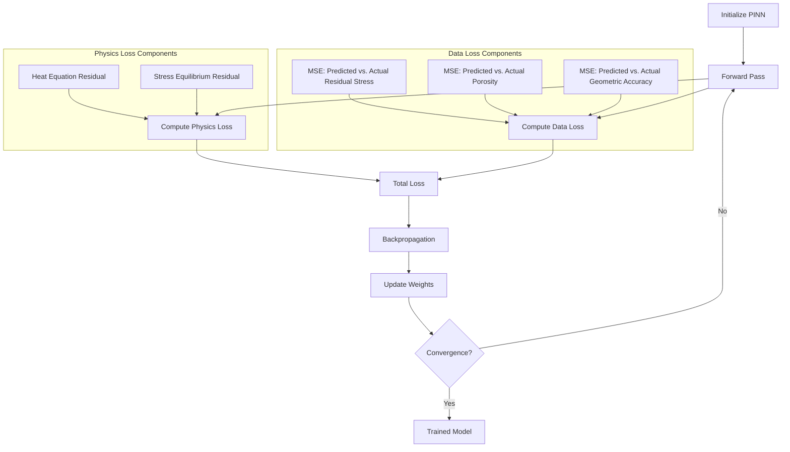
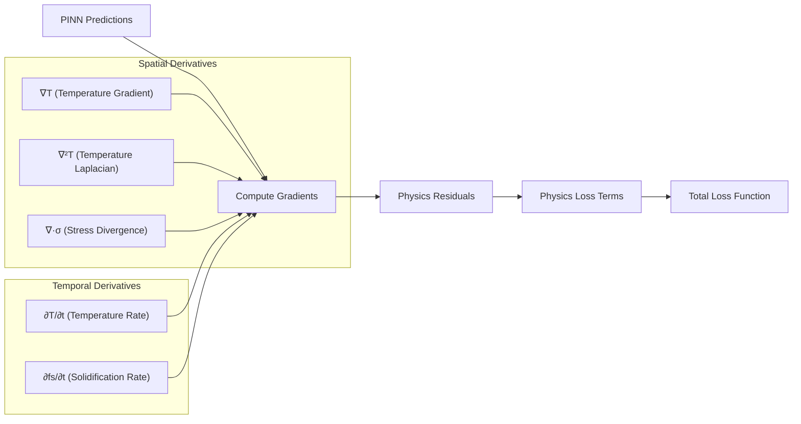
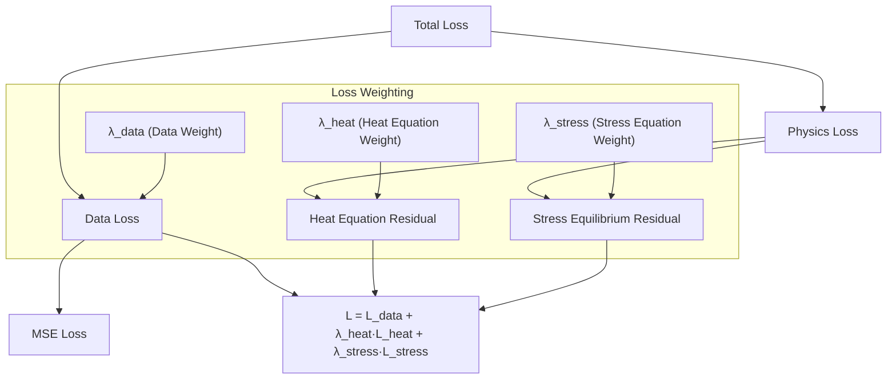
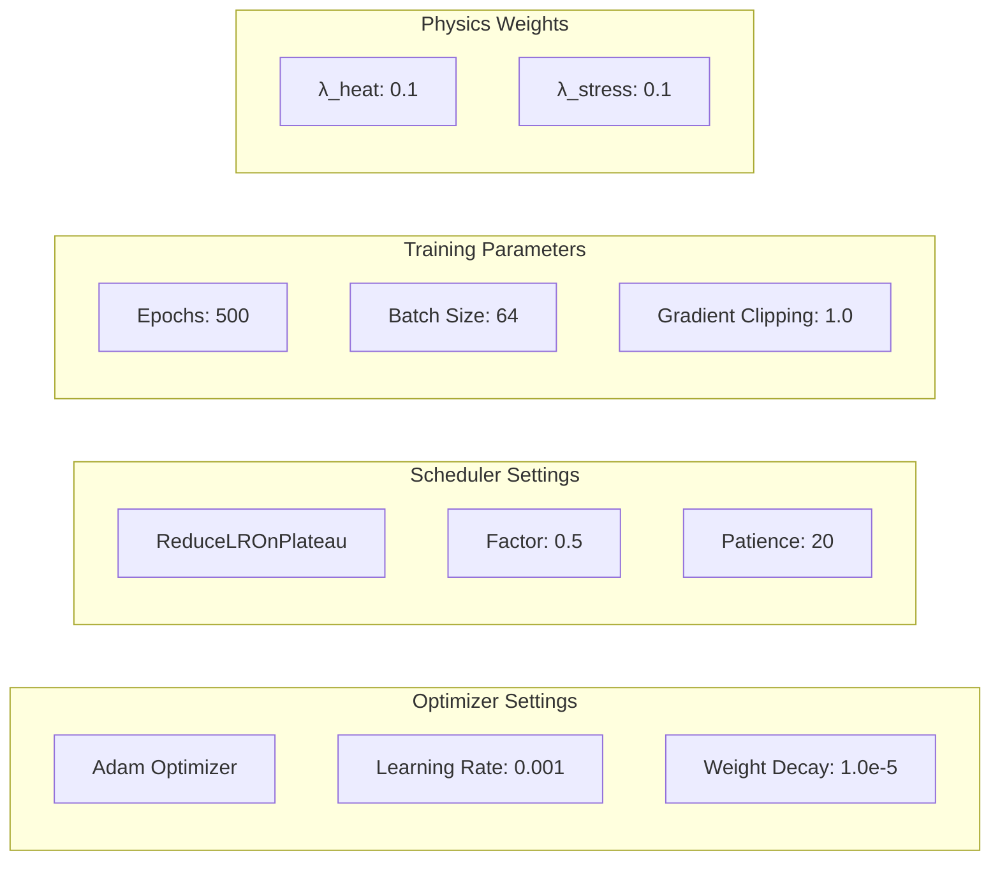

# LPBF PINN Model Architecture

This document provides flowcharts and explanations of the Physics-Informed Neural Network (PINN) architecture used in the LPBF optimization framework.

## PINN Model Overview

## Neural Network Architecture

## PINN Training Process

## Automatic Differentiation for Physics Constraints

## Loss Function Components

## Training Hyperparameters

