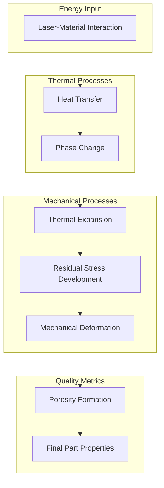
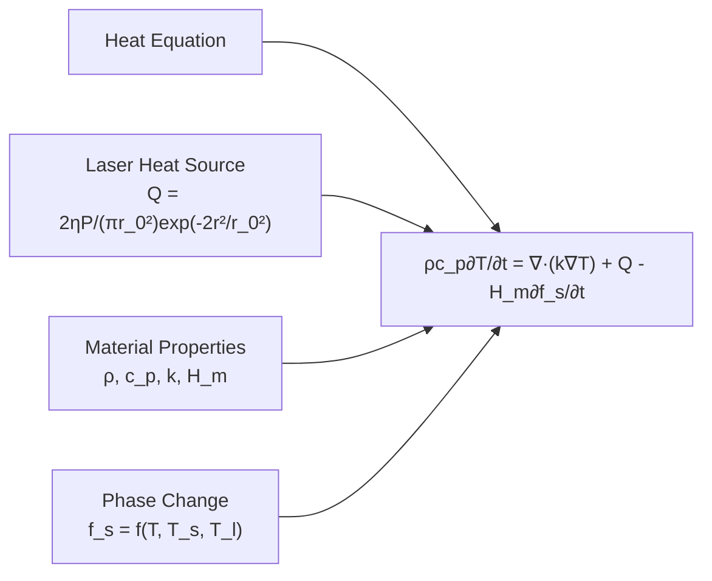
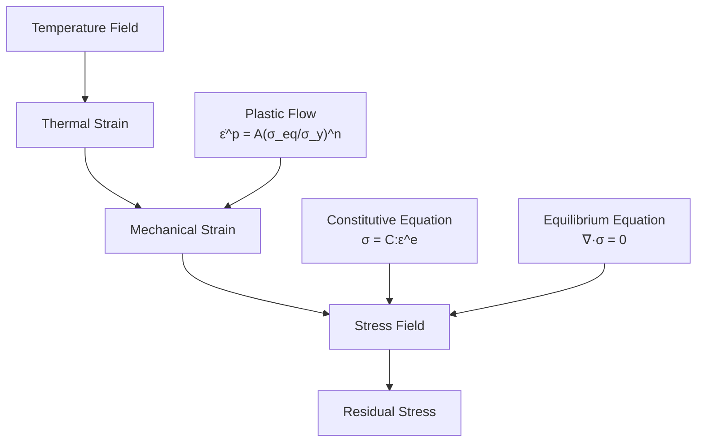
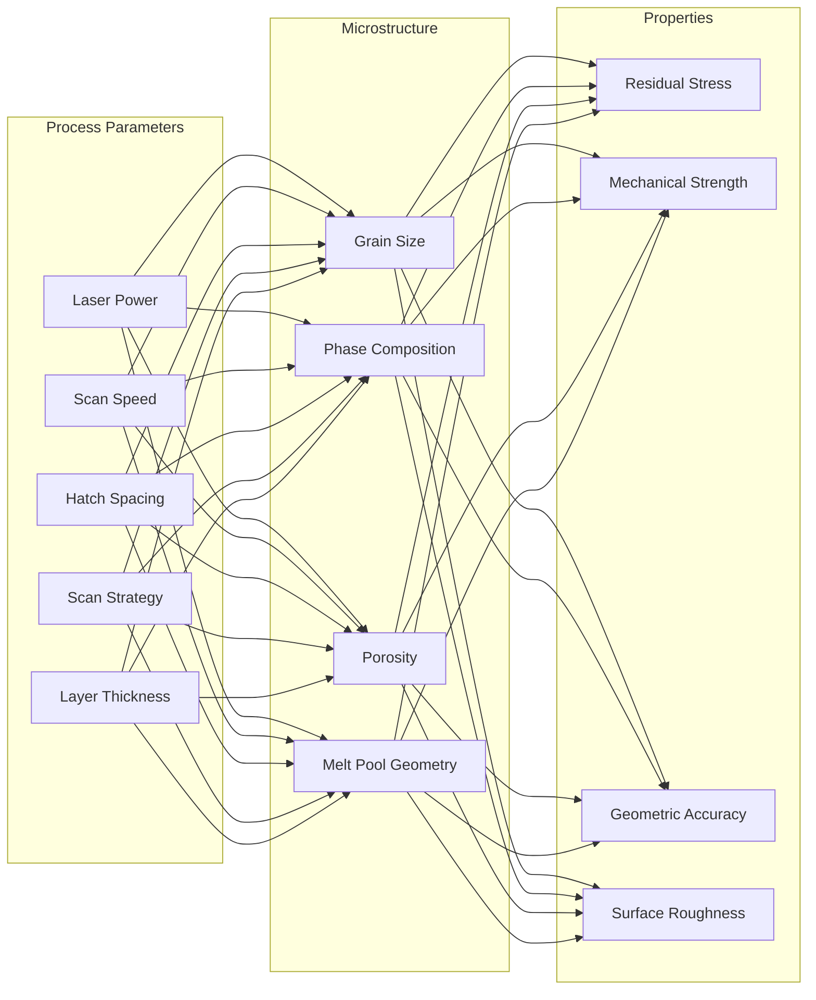
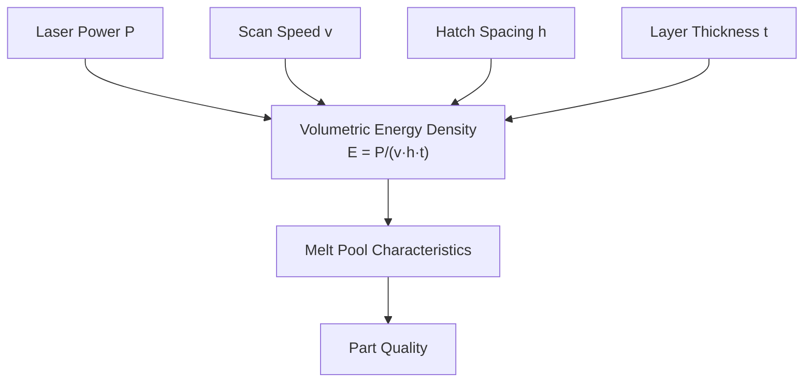

# LPBF Scientific Workflow

This document provides flowcharts and explanations of the scientific processes involved in Laser Powder Bed Fusion (LPBF) optimization.

## Physics-Based Modeling Workflow

## Heat Transfer Equation

The heat transfer in LPBF is modeled using the heat equation with a moving laser source:

Where:
- ρ: Density (kg/m³)
- c_p: Specific heat capacity (J/kg·K)
- T: Temperature (K)
- t: Time (s)
- k: Thermal conductivity (W/m·K)
- η: Laser absorption coefficient
- P: Laser power (W)
- r_0: Laser beam radius (mm)
- r: Distance from laser center (mm)
- H_m: Latent heat of melting (J/kg)
- f_s: Solid fraction

## Residual Stress Development

Where:
- σ: Stress tensor
- C: Elasticity tensor
- ε^e: Elastic strain tensor
- ε^p: Plastic strain tensor
- σ_eq: Equivalent stress
- σ_y: Yield strength
- A, n: Material constants

## Process-Structure-Property Relationships

## Energy Density Relationship

