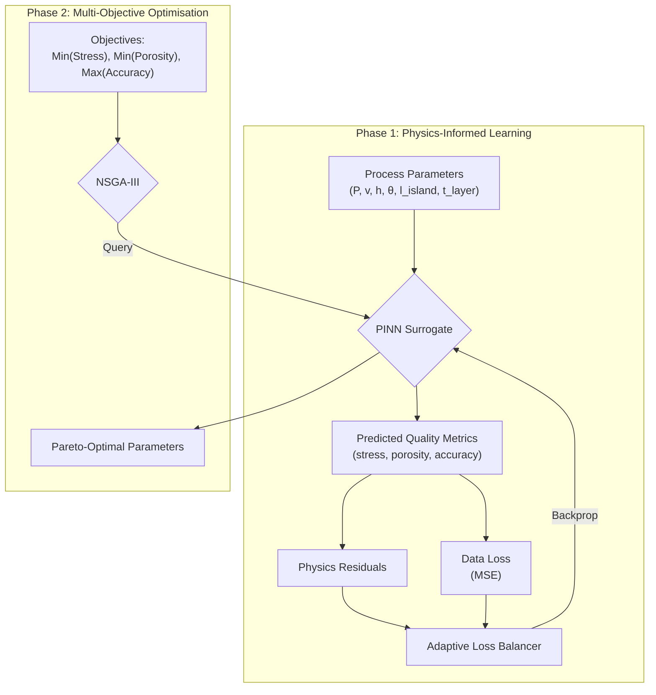

# LPBF-Optimizer Living Repository Implementation Plan

> **For agentic workers:** REQUIRED SUB-SKILL: Use `superpowers:subagent-driven-development` (recommended) or `superpowers:executing-plans` to implement this plan task-by-task. Steps use checkbox (`- [ ]`) syntax for tracking.

**Goal:** Fix known bugs, refresh documentation, add tests and CI, and establish repository standards so LPBF-Optimizer is a runnable, maintainable project.

**Architecture:** Keep the existing single-headed PINN that predicts residual stress / porosity / geometric accuracy. Reconcile the physics-loss module so it computes residuals from those three quality-metric outputs plus an analytic temperature field. Update the optimizer to respect objective directions. Add a `tests/` suite, GitHub Actions CI, and standard repository files (`pyproject.toml`, `LICENSE`, `CONTRIBUTING.md`, etc.).

**Tech Stack:** Python 3.10/3.11, PyTorch 2.x, pymoo, Ax/BoTorch, HDF5, pytest, ruff, GitHub Actions.

---

## File structure (new / modified)

| Path | Action | Responsibility |
|------|--------|----------------|
| `data/params.yaml` | Modify | Central config with relative paths, new fields, corrected scheduler spelling. |
| `requirements.txt` | Modify | Add missing runtime dependencies. |
| `src/pinn/model.py` | Modify | Fix default `in_dim` to match config. |
| `src/pinn/physics.py` | Rewrite | Physics-informed residuals aligned with the 3 quality-metric outputs. |
| `src/pinn/train.py` | Modify | Remove duplicate import / debug prints, add input helper, support 4 physics loss components, create `latest` symlink, fallback style. |
| `src/pinn/loss_balancer.py` | Modify | Keep interface; optionally balance 5 losses. |
| `src/optimiser/nsga3.py` | Modify | Negate `geometric_accuracy`, fix paths, remove duplicate import. |
| `src/optimiser/bayesopt.py` | Modify | Remove broken/unused code, fix paths. |
| `src/generate_synthetic_data.py` | Modify | Fix default config path. |
| `README.md` | Modify | Accurate Quick Start, objective directions, GIF captions. |
| `SUBMISSION.md` | Modify | Reflect fixed workflow. |
| `AGENTS.md` | Modify | Update known issues and conventions. |
| `docs/pinn_model_architecture.md` | Modify | Correct input dim and epochs. |
| `docs/training_metrics.md` | Modify | Fix unrendered variables. |
| `docs/figures.md` | Modify | Replace unrelated content with project figure index. |
| `todo.md` | Modify | Updated roadmap. |
| `tests/**/*.py` | Create | Unit and integration tests. |
| `pyproject.toml` | Create | Project metadata, tool config. |
| `environment.yml` | Create | Conda environment spec. |
| `LICENSE` | Create | MIT license text. |
| `CONTRIBUTING.md` | Create | Contributor guide. |
| `CHANGELOG.md` | Create | Change log. |
| `.github/workflows/ci.yml` | Create | GitHub Actions test workflow. |
| `.github/ISSUE_TEMPLATE/*.md` | Create | Bug report / feature request templates. |
| `.github/PULL_REQUEST_TEMPLATE.md` | Create | PR template. |
| `.pre-commit-config.yaml` | Create | Pre-commit hooks (ruff, trailing whitespace). |
| `docs/adr/*.md` | Create | Architecture Decision Records. |
| `docs/research/literature-survey.md` | Create | Research context and references. |

---

## Task 1: Fix configuration and dependencies

**Files:**
- Modify: `data/params.yaml`
- Modify: `requirements.txt`

- [ ] **Step 1: Replace hardcoded paths and add missing fields in `data/params.yaml`**

Replace the entire file contents with:

```yaml
# Configuration parameters for LPBF-Optimizer

# Material properties
material_properties:
  # Ti-6Al-4V properties
  rho: 4430.0       # Density (kg/m^3)
  cp: 526.3         # Specific heat capacity (J/kg·K)
  k: 6.7            # Thermal conductivity (W/m·K)
  eta: 0.35         # Laser absorption coefficient
  r0: 0.05          # Laser beam radius (mm)
  Hm: 286000.0      # Latent heat of melting (J/kg)
  Ts: 1604.0        # Solidus temperature (K)
  Tl: 1660.0        # Liquidus temperature (K)
  E: 110.0          # Young's modulus (GPa)
  nu: 0.34          # Poisson's ratio
  alpha: 8.6e-6     # Thermal expansion coefficient (1/K)
  sigma_y: 1100.0   # Yield strength (MPa)

# Neural network model configuration
model:
  input_dim: 10      # Process parameters + spatial coordinates + time
  output_dim: 3      # Residual stress, porosity, geometric accuracy
  hidden_width: 512  # Width of hidden layers
  hidden_depth: 5    # Number of hidden layers
  dropout_rate: 0.1  # MC Dropout rate for UQ (Gal & Ghahramani, 2016)

# Data configuration
data:
  raw_data_dir: "data/raw"
  processed_data_path: "data/processed/lpbf_dataset.h5"
  train_split: 0.8   # Fraction of data for training
  val_split: 0.1     # Fraction of data for validation
  test_split: 0.1    # Fraction of data for testing

# Training configuration
training:
  n_epochs: 50
  batch_size: 64
  random_seed: 42
  device: "auto"     # "auto", "cpu", or "cuda"
  normalize: false   # Enable input normalization (reserved for future work)
  balancer_alpha: 1.5 # Alpha for Adaptive Loss Balancing (Wang et al. 2021)
  optimizer:
    type: "adam"
    learning_rate: 0.001
    weight_decay: 1.0e-5
  scheduler:
    type: "reduce_lr_on_plateau"
    factor: 0.5
    patience: 20
  lambda_heat: 0.1   # Weight for heat equation physics loss
  lambda_stress: 0.1 # Weight for stress equation physics loss
  lambda_porosity: 0.05
  lambda_geometry: 0.05
  clip_grad: true
  clip_value: 1.0
  checkpoint_freq: 10
  output_dir: "data/models"
  plot_freq: 10
  print_freq: 5

# FEA configuration
fea:
  solver_type: "abaqus"
  abaqus_path: "abaqus"
  comsol_path: "comsol"
  comsol_java_path: "/Applications/COMSOL55/Multiphysics/plugins/org.comsol.model.jarfile/model.jar"
  template_path: "data/templates/lpbf_template.inp"
  output_dir: "data/raw/fea_results"
  n_cpus: 4
  max_parallel: 4

# Validation configuration (stubs)
validate:
  output_dir: "builds"
  machine_ip: ""
  dry_run: true

# Optimizer configuration
optimizer:
  algorithm: "nsga3"  # or "bayesopt"
  output_dir: "data/optimized"

  # Parameter bounds for optimization
  param_bounds:
    P: [150, 400]     # Laser power (W)
    v: [100, 2000]    # Scan speed (mm/s)
    h: [0.05, 0.15]   # Hatch spacing (mm)
    theta: [0, 90]    # Scan angle (degrees)
    l_island: [2, 10] # Island size (mm)
    layer_thickness: [0.02, 0.06]  # Layer thickness (mm)

  # NSGA-III specific settings
  pop_size: 100
  n_gen: 100
  n_partitions: 12

  # Objectives to optimize
  objectives:
    - "residual_stress"  # Minimize residual stress
    - "porosity"         # Minimize porosity
    - "geometric_accuracy"  # Maximize geometric accuracy (handled by negation in optimizer)

  # Bayesian optimization specific settings
  n_trials: 50
  seed: 42
```

- [ ] **Step 2: Add missing dependencies to `requirements.txt`**

Append these lines before the `# Optional` sections:

```text
# Visualization extras
seaborn>=0.12.0

# Validation extras
scikit-learn>=1.3.0
```

- [ ] **Step 3: Commit**

```bash
git add data/params.yaml requirements.txt
git commit -m "fix(config): relative paths, missing fields, deps"
```

---

## Task 2: Fix PINN default input dimension

**Files:**
- Modify: `src/pinn/model.py`

- [ ] **Step 1: Change default `in_dim` from 9 to 10**

Replace line 16:

```python
    def __init__(self, in_dim=9, out_dim=3, width=512, depth=5, dropout_rate=0.1):
```

with:

```python
    def __init__(self, in_dim=10, out_dim=3, width=512, depth=5, dropout_rate=0.1):
```

Also update docstrings on lines 11 and 21 from "number of process parameters" to "total input dimension (process parameters + spatial coordinates + time)".

- [ ] **Step 2: Commit**

```bash
git add src/pinn/model.py
git commit -m "fix(pinn): default input dimension matches config (10)"
```

---

## Task 3: Rewrite physics loss module

**Files:**
- Rewrite: `src/pinn/physics.py`

- [ ] **Step 1: Replace `src/pinn/physics.py` with the reconciled implementation**

```python
import torch


def _analytic_temperature(S, coords, t, mat_props):
    """Rosenthal-like analytic temperature rise from a moving point source.

    Args:
        S (torch.Tensor): Process parameters [N, n_params].
        coords (torch.Tensor): Spatial coordinates [N, 3], requires_grad=True.
        t (torch.Tensor): Time [N, 1], requires_grad=True.
        mat_props (dict): Material properties.

    Returns:
        torch.Tensor: Temperature field [N, 1].
    """
    P = S[:, 0:1]
    v = S[:, 1:2]
    eta = mat_props['eta']
    k = mat_props['k']
    r0 = mat_props['r0']

    x_laser = v * t
    r_squared = (coords[:, 0:1] - x_laser) ** 2 + coords[:, 1:2] ** 2 + coords[:, 2:3] ** 2

    # Gaussian heat source intensity
    q = 2.0 * eta * P / (torch.pi * r0 ** 2) * torch.exp(-2.0 * r_squared / r0 ** 2)

    # Steady-state moving point-source approximation
    T0 = 300.0
    T = T0 + q / (2.0 * torch.pi * k * torch.sqrt(r_squared + 1e-6))
    return T


def _laplacian(field, coords):
    """Compute the Laplacian of `field` with respect to `coords`."""
    grad_field = torch.autograd.grad(
        field.sum(), coords, create_graph=True, retain_graph=True
    )[0]
    laplacian = 0.0
    for i in range(coords.shape[1]):
        second = torch.autograd.grad(
            grad_field[:, i].sum(), coords, create_graph=True, retain_graph=True
        )[0][:, i]
        laplacian = laplacian + second
    return laplacian


def _heat_residual(T, S, coords, t, mat_props):
    """Transient heat equation residual for the analytic temperature field."""
    rho = mat_props['rho']
    cp = mat_props['cp']
    k = mat_props['k']
    Hm = mat_props['Hm']
    Ts = mat_props['Ts']
    Tl = mat_props['Tl']
    eta = mat_props['eta']
    r0 = mat_props['r0']

    dTdt = torch.autograd.grad(T.sum(), t, create_graph=True, retain_graph=True)[0]
    laplacian_T = _laplacian(T, coords)

    # Latent heat phase-change term
    fs = 0.5 * (1.0 + torch.tanh((Tl - T) / (Tl - Ts) * 10.0))
    dfsdT = torch.autograd.grad(fs.sum(), T, create_graph=True, retain_graph=True)[0]
    dfsdt = dfsdT * dTdt

    # Gaussian laser source
    P = S[:, 0:1]
    v = S[:, 1:2]
    x_laser = v * t
    r_squared = (coords[:, 0:1] - x_laser) ** 2 + coords[:, 1:2] ** 2 + coords[:, 2:3] ** 2
    q_laser = 2.0 * eta * P / (torch.pi * r0 ** 2) * torch.exp(-2.0 * r_squared / r0 ** 2)

    residual = rho * cp * dTdt - k * laplacian_T - q_laser + Hm * dfsdt
    return residual


def _stress_residual(sigma, T, coords, mat_props):
    """Thermo-elastic equilibrium residual for the predicted residual stress.

    The predicted residual stress is treated as a scalar field. The residual
    penalises the deviation of its Laplacian from the thermo-elastic source
    induced by the temperature field.
    """
    E = mat_props['E'] * 1e9  # GPa -> Pa for consistent constitutive scale
    alpha = mat_props['alpha']
    nu = mat_props['nu']

    laplacian_sigma = _laplacian(sigma, coords)
    laplacian_T = _laplacian(T, coords)

    # Thermo-elastic source term (simplified)
    source = (E * alpha / (1.0 - nu)) * laplacian_T
    residual = laplacian_sigma - source
    return residual


def _porosity_residual(porosity, S):
    """Porosity residual against an empirical energy-density indicator."""
    P = S[:, 0]
    v = S[:, 1]
    h = S[:, 2]
    t = S[:, 5]  # layer thickness
    energy_density = P / (v * h * t + 1e-8)
    optimal_ed = 0.15
    porosity_indicator = 0.05 + 0.2 * (energy_density - optimal_ed) ** 2
    residual = porosity.squeeze() - porosity_indicator
    return residual


def _geometry_residual(accuracy, T, coords):
    """Geometric accuracy residual against a nominal accuracy indicator."""
    grad_T = torch.autograd.grad(
        T.sum(), coords, create_graph=True, retain_graph=True
    )[0]
    grad_T_mag = torch.sqrt(torch.sum(grad_T ** 2, dim=1) + 1e-8)
    accuracy_indicator = 1.0 - 0.1 * grad_T_mag
    accuracy_indicator = torch.clamp(accuracy_indicator, 0.7, 1.0)
    residual = accuracy.squeeze() - accuracy_indicator
    return residual


def compute_physics_loss(
    model,
    S_batch,
    coords_batch,
    t_batch,
    mat_props,
    lambda_heat=1.0,
    lambda_stress=1.0,
    lambda_porosity=0.1,
    lambda_geometry=0.1,
    return_components=False,
):
    """Compute physics-informed regularisation losses aligned with model outputs.

    The PINN predicts [residual_stress, porosity, geometric_accuracy].  This
    function computes:
      - heat residual from an analytic temperature field,
      - stress-equilibrium residual from the predicted residual stress,
      - porosity residual from an empirical energy-density indicator,
      - geometric accuracy residual from a nominal accuracy indicator.

    Args:
        model: PINN model.
        S_batch (torch.Tensor): Process parameters [N, n_params].
        coords_batch (torch.Tensor): Spatial coordinates [N, 3].
        t_batch (torch.Tensor): Time [N, 1].
        mat_props (dict): Material properties.
        lambda_heat (float): Weight for heat residual.
        lambda_stress (float): Weight for stress residual.
        lambda_porosity (float): Weight for porosity residual.
        lambda_geometry (float): Weight for geometry residual.
        return_components (bool): If True, returns individual losses.

    Returns:
        torch.Tensor or tuple: Total physics loss, or (heat, stress, porosity, geometry) losses.
    """
    # Enable autograd on spatial and temporal inputs for residual computation.
    coords = coords_batch.clone().requires_grad_(True)
    t = t_batch.clone().requires_grad_(True)

    # Forward pass with differentiable inputs.
    model_input = torch.cat([S_batch, coords, t], dim=1)
    out = model(model_input)

    residual_stress = out[:, 0:1]
    porosity = out[:, 1:2]
    geometric_accuracy = out[:, 2:3]

    T = _analytic_temperature(S_batch, coords, t, mat_props)

    heat_res = _heat_residual(T, S_batch, coords, t, mat_props)
    heat_loss = torch.mean(heat_res ** 2)

    stress_res = _stress_residual(residual_stress, T, coords, mat_props)
    stress_loss = torch.mean(stress_res ** 2)

    porosity_res = _porosity_residual(porosity, S_batch)
    porosity_loss = torch.mean(porosity_res ** 2)

    geometry_res = _geometry_residual(geometric_accuracy, T, coords)
    geometry_loss = torch.mean(geometry_res ** 2)

    if return_components:
        return heat_loss, stress_loss, porosity_loss, geometry_loss

    total = (
        lambda_heat * heat_loss
        + lambda_stress * stress_loss
        + lambda_porosity * porosity_loss
        + lambda_geometry * geometry_loss
    )
    return total
```

- [ ] **Step 2: Run the physics test to verify no runtime errors**

```bash
python - <<'PY'
import torch
import sys
sys.path.insert(0, 'src/pinn')
from model import PINN
from physics import compute_physics_loss

model = PINN(in_dim=10, out_dim=3)
S = torch.rand(8, 6)
coords = torch.rand(8, 3)
t = torch.rand(8, 1)
mat_props = {'rho': 4430.0, 'cp': 526.3, 'k': 6.7, 'eta': 0.35, 'r0': 0.05,
             'Hm': 286000.0, 'Ts': 1604.0, 'Tl': 1660.0, 'E': 110.0,
             'nu': 0.34, 'alpha': 8.6e-6, 'sigma_y': 1100.0}
loss = compute_physics_loss(model, S, coords, t, mat_props)
print('physics loss:', loss.item())
assert torch.isfinite(loss)
PY
```

Expected output: a finite scalar physics loss value.

- [ ] **Step 3: Commit**

```bash
git add src/pinn/physics.py
git commit -m "fix(pinn): reconcile physics loss with quality-metric outputs"
```

---

## Task 4: Clean up training loop

**Files:**
- Modify: `src/pinn/train.py`

- [ ] **Step 1: Remove duplicate import and debug prints**

Delete the duplicate line 15 (`from model import PINN`).

Delete lines 207-211 (the four `print(f"DEBUG: ...")` statements).

- [ ] **Step 2: Add input helper and symlink creation**

Insert the following static method after `setup_directories` (around line 94):

```python
    @staticmethod
    def _build_model_input(S_batch, coords_batch, t_batch, input_dim):
        """Build model input, trimming parameter dims if they exceed input_dim."""
        combined = torch.cat([S_batch, coords_batch, t_batch], dim=1)
        if combined.shape[1] > input_dim:
            s_keep = input_dim - coords_batch.shape[1] - t_batch.shape[1]
            if s_keep < 0:
                raise ValueError(
                    f"input_dim ({input_dim}) is smaller than coord ({coords_batch.shape[1]}) + time ({t_batch.shape[1]}) dims"
                )
            return torch.cat([S_batch[:, :s_keep], coords_batch, t_batch], dim=1)
        return combined
```

In `setup_directories`, after `self.plot_dir.mkdir(...)` add:

```python
        # Create/update a stable symlink to the latest run
        latest_link = Path(self.config['training']['output_dir']) / 'latest'
        if latest_link.exists() or latest_link.is_symlink():
            latest_link.unlink()
        try:
            latest_link.symlink_to(self.run_dir.resolve(), target_is_directory=True)
        except OSError:
            # Symlinks may not be supported on all platforms (e.g. Windows without dev mode)
            pass
```

- [ ] **Step 3: Make scheduler spelling consistent**

In `_build_scheduler`, replace the condition `sched_config['type'].lower() == 'reducelronplateau'` with:

```python
        if sched_config['type'].lower() in ('reduce_lr_on_plateau', 'reducelronplateau'):
```

- [ ] **Step 4: Use device from config and safer DataLoader settings**

Replace the device assignment block (lines 43-45) with:

```python
        device_cfg = self.config['training'].get('device', 'auto')
        if device_cfg == 'cuda' or (device_cfg == 'auto' and torch.cuda.is_available()):
            self.device = torch.device('cuda')
        else:
            self.device = torch.device('cpu')
        print(f"Using device: {self.device}")
```

In `load_data`, make `num_workers` safe on macOS and respect config. Replace both DataLoader constructors with:

```python
        import platform
        num_workers = self.config['training'].get('num_workers', None)
        if num_workers is None:
            num_workers = 0 if platform.system() == 'Darwin' else self.num_threads
        pin_memory = self.device.type == 'cuda'
        persistent = num_workers > 0

        self.train_loader = torch.utils.data.DataLoader(
            train_dataset,
            batch_size=self.config['training']['batch_size'],
            shuffle=True,
            num_workers=num_workers,
            pin_memory=pin_memory,
            persistent_workers=persistent
        )

        self.val_loader = torch.utils.data.DataLoader(
            val_dataset,
            batch_size=self.config['training']['batch_size'],
            num_workers=num_workers,
            pin_memory=pin_memory,
            persistent_workers=persistent
        )
```

- [ ] **Step 5: Replace `train_step` to use helper and four physics components**

Replace the entire `train_step` method with:

```python
    def train_step(self, S_batch, coords_batch, t_batch, y_batch):
        self.optimizer.zero_grad()

        input_dim = self.config['model']['input_dim']
        model_input = self._build_model_input(S_batch, coords_batch, t_batch, input_dim)
        y_pred = self.model(model_input)

        mse_loss = nn.MSELoss()
        data_loss = mse_loss(y_pred, y_batch)

        heat_loss, stress_loss, porosity_loss, geometry_loss = compute_physics_loss(
            self.model,
            S_batch,
            coords_batch,
            t_batch,
            self.mat_props,
            return_components=True,
        )

        train_cfg = self.config['training']
        lambda_heat = train_cfg.get('lambda_heat', 0.1)
        lambda_stress = train_cfg.get('lambda_stress', 0.1)
        lambda_porosity = train_cfg.get('lambda_porosity', 0.05)
        lambda_geometry = train_cfg.get('lambda_geometry', 0.05)

        # Shared parameter for GradNorm (last hidden layer weight matrix)
        shared_params = list(self.model.hidden[-1].parameters())[0] if hasattr(self.model, 'hidden') else list(self.model.parameters())[-2]

        raw_losses = [
            data_loss,
            lambda_heat * heat_loss,
            lambda_stress * stress_loss,
            lambda_porosity * porosity_loss + lambda_geometry * geometry_loss,
        ]

        try:
            weights = self.loss_balancer.update_weights(raw_losses, shared_params)
            total_loss = sum(w * l for w, l in zip(weights, raw_losses))
            current_weights = weights.detach().cpu().numpy()
            self.metrics['loss_weights']['data'].append(float(current_weights[0]))
            self.metrics['loss_weights']['heat'].append(float(current_weights[1]))
            self.metrics['loss_weights']['stress'].append(float(current_weights[2]))
            self.metrics['loss_weights']['mechanical'].append(float(current_weights[3]))
        except RuntimeError as e:
            # Fallback to static weighting if GradNorm graph fails
            total_loss = (
                data_loss
                + lambda_heat * heat_loss
                + lambda_stress * stress_loss
                + lambda_porosity * porosity_loss
                + lambda_geometry * geometry_loss
            )
            self.metrics['loss_weights']['data'].append(1.0)
            self.metrics['loss_weights']['heat'].append(lambda_heat)
            self.metrics['loss_weights']['stress'].append(lambda_stress)
            self.metrics['loss_weights']['mechanical'].append((lambda_porosity + lambda_geometry) / 2.0)

        total_loss.backward()

        if train_cfg.get('clip_grad', False):
            torch.nn.utils.clip_grad_norm_(
                self.model.parameters(),
                train_cfg.get('clip_value', 1.0)
            )

        self.optimizer.step()

        return {
            'total': total_loss.item(),
            'data': data_loss.item(),
            'physics': (
                lambda_heat * heat_loss
                + lambda_stress * stress_loss
                + lambda_porosity * porosity_loss
                + lambda_geometry * geometry_loss
            ).item(),
            'heat': heat_loss.item(),
            'stress': stress_loss.item(),
            'porosity': porosity_loss.item(),
            'geometry': geometry_loss.item(),
        }
```

Initialize the `mechanical` key in the `metrics` dict (line 71) by changing:

```python
            'loss_weights': {'data': [], 'heat': [], 'stress': []}
```

to:

```python
            'loss_weights': {'data': [], 'heat': [], 'stress': [], 'mechanical': []}
```

- [ ] **Step 6: Update `validate` to use `_build_model_input`**

Replace the forward-pass block inside `validate` (lines 379-394) with:

```python
                input_dim = self.config['model']['input_dim']
                model_input = self._build_model_input(S_batch, coords_batch, t_batch, input_dim)
                y_pred = self.model(model_input)
```

- [ ] **Step 7: Make plotting robust to missing seaborn**

Replace line 463:

```python
        plt.style.use('seaborn-v0_8-whitegrid')
```

with:

```python
        try:
            plt.style.use('seaborn-v0_8-whitegrid')
        except OSError:
            pass
```

- [ ] **Step 8: Run a short training smoke test**

```bash
python src/generate_synthetic_data.py --config data/params.yaml --scan-vectors 10 --points-per-vector 64
python src/pinn/train.py --config data/params.yaml
```

Expected: training completes without runtime errors and creates `data/models/latest/checkpoints/best_model.pt`.

- [ ] **Step 9: Commit**

```bash
git add src/pinn/train.py
git commit -m "fix(pinn): clean training loop, support 4 physics components, latest symlink"
```

---

## Task 5: Fix NSGA-III optimizer

**Files:**
- Modify: `src/optimiser/nsga3.py`

- [ ] **Step 1: Remove duplicate `import os` and fix objective direction**

Delete the second `import os` on line 18.

In `SurrogateProblem._evaluate`, replace the block lines 92-101:

```python
        # Extract objective values (note: for minimization, so we might need to negate some)
        # We'll keep residual stress and porosity as is (minimize)
        # But for geometric accuracy ratio (GAR), higher is better, so we negate
        objectives = predictions.cpu().numpy()
        
        # Set the objective values for pymoo
        out["F"] = objectives
        
        # For visualization, we might also want to return the predicted values directly
        out["prediction"] = objectives
```

with:

```python
        # Extract objective values. Residual stress and porosity are minimised.
        # Geometric accuracy is maximised in reality, so we negate it for pymoo.
        objectives = predictions.cpu().numpy().copy()
        for i, name in enumerate(self.objectives):
            if name == 'geometric_accuracy':
                objectives[:, i] = -objectives[:, i]

        out["F"] = objectives
        out["prediction"] = predictions.cpu().numpy()
```

- [ ] **Step 2: Fix default config path and model import path**

Change the default config argument on line 356 from:

```python
    parser.add_argument('--config', type=str, default='../../data/params.yaml',
```

to:

```python
    parser.add_argument('--config', type=str, default='data/params.yaml',
```

Make the model import in `_load_model` robust to the script being run from any directory. Replace lines 148-151:

```python
        import sys
        import os
        sys.path.append(os.path.join(os.path.dirname(__file__), '..', 'pinn'))
        from model import PINN
```

with:

```python
        import sys
        from pathlib import Path
        repo_root = Path(__file__).resolve().parents[2]
        sys.path.insert(0, str(repo_root / 'src' / 'pinn'))
        from model import PINN
```

- [ ] **Step 3: Avoid blocking PCP plot in non-interactive environments**

Replace lines 323-329:

```python
        # Plot parallel coordinates for more than 3 objectives
        from pymoo.visualization.pcp import PCP
        pcp = PCP(tight_layout=True, legend=(True, {'loc': 'upper left'}))
        pcp.add(F, color="navy")
        pcp.show()
        plt.savefig(self.output_dir / 'pareto_pcp.png')
        plt.close()
```

with:

```python
        # Plot parallel coordinates for more than 3 objectives
        if F.shape[1] >= 2:
            from pymoo.visualization.pcp import PCP
            pcp = PCP(tight_layout=True, legend=(True, {'loc': 'upper left'}))
            pcp.add(F, color="navy")
            pcp.save(self.output_dir / 'pareto_pcp.png')
```

- [ ] **Step 4: Commit**

```bash
git add src/optimiser/nsga3.py
git commit -m "fix(optimiser): nsga3 objective direction, paths, cleanup"
```

---

## Task 6: Fix Bayesian optimizer

**Files:**
- Modify: `src/optimiser/bayesopt.py`

- [ ] **Step 1: Remove unused / broken imports and code**

Replace lines 10-13:

```python
from ax.service.managed_loop import optimize
from ax.utils.notebook.plotting import render, init_notebook_plotting
from ax.utils.tutorials.cbo_utils import normalize
import ax.modelbridge.registry as registry
```

with:

```python
from ax.service.managed_loop import optimize
```

Remove the `_plot_importance` method entirely (lines 301-326) and its call on line 281 (`self._plot_importance(model, objective_name)`).

- [ ] **Step 2: Fix default config path and model import**

Change the default config argument on line 334 from:

```python
    parser.add_argument('--config', type=str, default='../../data/params.yaml',
```

to:

```python
    parser.add_argument('--config', type=str, default='data/params.yaml',
```

Replace the model import block in `_load_model` (lines 58-61) with:

```python
        import sys
        from pathlib import Path
        repo_root = Path(__file__).resolve().parents[2]
        sys.path.insert(0, str(repo_root / 'src' / 'pinn'))
        from model import PINN
```

- [ ] **Step 3: Commit**

```bash
git add src/optimiser/bayesopt.py
git commit -m "fix(optimiser): bayesopt cleanup, remove broken feature importance"
```

---

## Task 7: Fix default config paths in data scripts

**Files:**
- Modify: `src/generate_synthetic_data.py`
- Modify: `src/preprocessing.py`
- Modify: `src/validate/build_runner.py`
- Modify: `src/validate/characterise.py`

- [ ] **Step 1: Update defaults to repo-root-relative paths**

For each file, change the `--config` default from `'../data/params.yaml'` or `'../../data/params.yaml'` to `'data/params.yaml'`.

Affected lines:
- `src/generate_synthetic_data.py` line 375
- `src/preprocessing.py` line 413
- `src/validate/build_runner.py` line 456
- `src/validate/characterise.py` line 823

- [ ] **Step 2: Commit**

```bash
git add src/generate_synthetic_data.py src/preprocessing.py src/validate/build_runner.py src/validate/characterise.py
git commit -m "fix(cli): repo-root-relative default config paths"
```

---

## Task 8: End-to-end smoke test

**Files:** None (verification only).

- [ ] **Step 1: Run the complete workflow**

```bash
python src/generate_synthetic_data.py --config data/params.yaml --scan-vectors 10 --points-per-vector 64
python src/pinn/train.py --config data/params.yaml
python src/optimiser/nsga3.py --config data/params.yaml --model data/models/latest/checkpoints/best_model.pt
```

- [ ] **Step 2: Verify outputs**

Check that these files exist:

```bash
ls data/processed/lpbf_dataset.h5
ls data/models/latest/checkpoints/best_model.pt
ls data/optimized/pareto_solutions.csv
```

- [ ] **Step 3: Commit any final small adjustments**

```bash
git commit -m "chore: verify end-to-end workflow" -a || true
```

---

## Task 9: Refresh README.md

**Files:**
- Modify: `README.md`

- [ ] **Step 1: Replace README.md with accurate content**

Overwrite `README.md` with:

```markdown


# LPBF-Optimizer: Physics-Informed Digital Twin for Additive Manufacturing


> **A Framework for Multi-Objective Optimisation in Laser Powder Bed Fusion (LPBF)**

---

## Scientific Abstract

**LPBF-Optimizer** couples a Physics-Informed Neural Network (PINN) surrogate with multi-objective evolutionary optimisation (NSGA-III) to map LPBF process parameters to part-quality metrics: residual stress, porosity, and geometric accuracy. The PINN is regularised by physics-informed residuals derived from an analytic temperature field and the predicted quality metrics, reducing reliance on large experimental or FEA datasets.

The framework includes research-grade implementations of Monte-Carlo Dropout for uncertainty quantification (Gal & Ghahramani, 2016) and GradNorm-style adaptive loss balancing (Wang et al., 2021).

---

## Core Architecture



### Loss Function

$$
\mathcal{L} = \lambda_{data}\mathcal{L}_{data} + \lambda_{heat}\mathcal{L}_{heat} + \lambda_{stress}\mathcal{L}_{stress} + \lambda_{porosity}\mathcal{L}_{porosity} + \lambda_{geometry}\mathcal{L}_{geometry}
$$

---

## Project Structure

| Module | File | Description |
| :--- | :--- | :--- |
| PINN | [`src/pinn/model.py`](src/pinn/model.py) | Network architecture with MC Dropout. |
| Physics | [`src/pinn/physics.py`](src/pinn/physics.py) | Physics-informed residuals. |
| Training | [`src/pinn/train.py`](src/pinn/train.py) | Training loop and checkpointing. |
| Optimisation | [`src/optimiser/nsga3.py`](src/optimiser/nsga3.py) | NSGA-III Pareto front. |
| Bayes Opt | [`src/optimiser/bayesopt.py`](src/optimiser/bayesopt.py) | Single-objective Bayesian optimisation. |
| Config | [`data/params.yaml`](data/params.yaml) | Centralised parameters. |

> **Note:** Validation modules (`src/validate/`) are stubs that document how real machine interfaces would be wired in. They are safe to run only in `dry_run=True` mode.

---

## Getting Started

### Prerequisites

- Python 3.10 or 3.11
- (Optional) NVIDIA GPU with CUDA

### Installation

```bash
git clone https://github.com/llMr-Sweetll/lpbf-optimizer.git
cd lpbf-optimizer
python -m venv venv
source venv/bin/activate  # Windows: .\venv\Scripts\activate
pip install -r requirements.txt
```

### Quick Start

```bash
# 1. Generate synthetic training data
python src/generate_synthetic_data.py --config data/params.yaml --scan-vectors 50 --points-per-vector 64

# 2. Train the PINN
python src/pinn/train.py --config data/params.yaml

# 3. Run NSGA-III optimisation
python src/optimiser/nsga3.py --config data/params.yaml --model data/models/latest/checkpoints/best_model.pt
```

Outputs:
- `data/processed/lpbf_dataset.h5`
- `data/models/latest/checkpoints/best_model.pt`
- `data/optimized/pareto_solutions.csv`

### Running Tests

```bash
pytest
```

---

## Troubleshooting

**OMP: Error #15 (Windows):**  
The trainer sets `KMP_DUPLICATE_LIB_OK=TRUE`. If the error persists, run:

```bash
set KMP_DUPLICATE_LIB_OK=TRUE
```

**CUDA out of memory:**  
Reduce `batch_size` in `data/params.yaml`.

---

## References

1. Gal, Y., & Ghahramani, Z. (2016). *Dropout as a Bayesian Approximation*. ICML.
2. Wang, S., Teng, Y., & Perdikaris, P. (2021). *Understanding and mitigating gradient flow pathologies*. SIAM.
3. Deb, K., & Jain, H. (2014). *An Evolutionary Many-Objective Optimization Algorithm*. IEEE.

---

## License

MIT — see [`LICENSE`](LICENSE).

*Developed for Advanced Manufacturing Research.*
```

- [ ] **Step 2: Commit**

```bash
git add README.md
git commit -m "docs: accurate README with workflow and objective directions"
```

---

## Task 10: Fix architecture documentation

**Files:**
- Modify: `docs/pinn_model_architecture.md`

- [ ] **Step 1: Correct input dimension and epochs**

Find the line stating "Input (9 neurons)" and replace with:

```markdown
- **Input (10 neurons):** 6 process parameters + 3 spatial coordinates + 1 time
```

Find the epoch hyperparameter line (currently "Epochs: 500") and replace with:

```markdown
- **Epochs:** 50 (default in `data/params.yaml`; reduce to 2 for CI smoke tests)
```

- [ ] **Step 2: Commit**

```bash
git add docs/pinn_model_architecture.md
git commit -m "docs: correct input dim and epochs in architecture doc"
```

---

## Task 11: Fix training metrics doc

**Files:**
- Modify: `docs/training_metrics.md`

- [ ] **Step 1: Replace unrendered template variables**

Replace any literal `${config.lambda_heat}` / `${config.lambda_stress}` with the actual field names, e.g.:

```markdown
The heat loss is weighted by `training.lambda_heat` and the stress loss by `training.lambda_stress`.
```

- [ ] **Step 2: Commit**

```bash
git add docs/training_metrics.md
git commit -m "docs: fix unrendered config variables"
```

---

## Task 12: Replace orphan figures doc

**Files:**
- Modify: `docs/figures.md`

- [ ] **Step 1: Overwrite with a project figure index**

```markdown
# Figures and Visualisations

This directory contains generated figures and animations used by the documentation.

| File | Source | Description |
|------|--------|-------------|
| `melt_pool_dynamics.gif` | `src/vis/animate_training.py` | Illustrative analytic temperature field (not PINN inference). |
| `optimization_evolution.gif` | `src/vis/animate_optimization.py` | Synthetic NSGA-III evolution illustration. |
| `loss_history.gif` | `src/vis/animate_training_metrics.py` | Synthetic loss-curve illustration. |
| `weights_evolution.gif` | `src/vis/animate_training_metrics.py` | Synthetic weight-evolution illustration. |
| `loss_curves.png` | `src/pinn/train.py` | Real training/validation loss curves. |
| `loss_components.png` | `src/pinn/train.py` | Data vs physics loss components. |
| `adaptive_weights.png` | `src/pinn/train.py` | Adaptive loss weights from GradNorm. |
| `pareto_front_3d.png` | `src/optimiser/nsga3.py` | Pareto front from NSGA-III. |
```

- [ ] **Step 2: Commit**

```bash
git add docs/figures.md
git commit -m "docs: replace orphan figures doc with figure index"
```

---

## Task 13: Update SUBMISSION.md and AGENTS.md

**Files:**
- Modify: `SUBMISSION.md`
- Modify: `AGENTS.md`

- [ ] **Step 1: Update SUBMISSION.md**

Replace its workflow section with:

```markdown
# LPBF-Optimizer — Quick Run

```bash
python src/generate_synthetic_data.py --config data/params.yaml --scan-vectors 50 --points-per-vector 64
python src/pinn/train.py --config data/params.yaml
python src/optimiser/nsga3.py --config data/params.yaml --model data/models/latest/checkpoints/best_model.pt
```

`geometric_accuracy` is maximised by NSGA-III internally (it is negated for pymoo's minimisation convention).
```

- [ ] **Step 2: Update AGENTS.md known-issues section**

Remove or mark as resolved the issues fixed in this plan (duplicate import, physics loss mismatch, hardcoded paths, missing deps, objective sign). Keep only genuinely outstanding items such as:

- Validation modules remain stubs.
- FEA runner requires external ABAQUS/COMSOL licenses.
- Default synthetic data is physics-inspired, not real FEA.

Add a short note about the new `tests/` directory and CI conventions.

- [ ] **Step 3: Commit**

```bash
git add SUBMISSION.md AGENTS.md
git commit -m "docs: update submission and agent guides"
```

---

## Task 14: Add PINN model tests

**Files:**
- Create: `tests/pinn/test_model.py`

- [ ] **Step 1: Create test file**

```python
import sys
from pathlib import Path

sys.path.insert(0, str(Path(__file__).resolve().parents[2] / 'src' / 'pinn'))

import torch
from model import PINN


def test_forward_pass_shape():
    model = PINN(in_dim=10, out_dim=3)
    x = torch.rand(16, 10)
    y = model(x)
    assert y.shape == (16, 3)


def test_default_input_dimension():
    model = PINN()
    assert model.in_dim == 10
    x = torch.rand(4, 10)
    y = model(x)
    assert y.shape == (4, 3)


def test_predict_with_uncertainty_returns_finite_std():
    model = PINN(in_dim=10, out_dim=3, dropout_rate=0.1)
    x = torch.rand(8, 10)
    mean, std = model.predict_with_uncertainty(x, num_samples=10)
    assert mean.shape == (8, 3)
    assert std.shape == (8, 3)
    assert torch.all(std >= 0)
    assert torch.all(torch.isfinite(mean))
    assert torch.all(torch.isfinite(std))
```

- [ ] **Step 2: Run the test**

```bash
pytest tests/pinn/test_model.py -v
```

Expected: 3 passed.

- [ ] **Step 3: Commit**

```bash
git add tests/pinn/test_model.py
git commit -m "test(pinn): model forward pass and uncertainty"
```

---

## Task 15: Add loss balancer tests

**Files:**
- Create: `tests/pinn/test_loss_balancer.py`

- [ ] **Step 1: Create test file**

```python
import sys
from pathlib import Path

sys.path.insert(0, str(Path(__file__).resolve().parents[2] / 'src' / 'pinn'))

import torch
import torch.nn.functional as F
from loss_balancer import AdaptiveLossBalancer


def test_weights_sum_to_num_losses():
    balancer = AdaptiveLossBalancer(num_losses=3, alpha=1.5)
    net = torch.nn.Linear(4, 3)
    x = torch.rand(3, 4)
    pred = net(x)
    target = torch.zeros(3, 3)
    losses = [F.mse_loss(pred[:, i], target[:, i]) for i in range(3)]

    weights = balancer.update_weights(losses, net.weight)
    assert torch.isclose(weights.sum(), torch.tensor(3.0), atol=1e-4)
```

- [ ] **Step 2: Run the test**

```bash
pytest tests/pinn/test_loss_balancer.py -v
```

Expected: 1 passed.

- [ ] **Step 3: Commit**

```bash
git add tests/pinn/test_loss_balancer.py
git commit -m "test(pinn): adaptive loss balancer weights"
```

---

## Task 16: Add physics loss tests

**Files:**
- Create: `tests/pinn/test_physics.py`

- [ ] **Step 1: Create test file**

```python
import sys
from pathlib import Path

sys.path.insert(0, str(Path(__file__).resolve().parents[2] / 'src' / 'pinn'))

import torch
from model import PINN
from physics import compute_physics_loss


MAT_PROPS = {
    'rho': 4430.0,
    'cp': 526.3,
    'k': 6.7,
    'eta': 0.35,
    'r0': 0.05,
    'Hm': 286000.0,
    'Ts': 1604.0,
    'Tl': 1660.0,
    'E': 110.0,
    'nu': 0.34,
    'alpha': 8.6e-6,
    'sigma_y': 1100.0,
}


def test_physics_loss_components_are_finite():
    model = PINN(in_dim=10, out_dim=3)
    S = torch.rand(8, 6)
    coords = torch.rand(8, 3)
    t = torch.rand(8, 1)
    heat, stress, porosity, geometry = compute_physics_loss(
        model, S, coords, t, MAT_PROPS, return_components=True
    )
    for loss in (heat, stress, porosity, geometry):
        assert torch.isfinite(loss)
        assert loss.item() >= 0.0


def test_total_physics_loss_is_weighted_sum():
    model = PINN(in_dim=10, out_dim=3)
    S = torch.rand(8, 6)
    coords = torch.rand(8, 3)
    t = torch.rand(8, 1)
    total = compute_physics_loss(
        model, S, coords, t, MAT_PROPS,
        lambda_heat=1.0, lambda_stress=2.0,
        lambda_porosity=3.0, lambda_geometry=4.0,
    )
    heat, stress, porosity, geometry = compute_physics_loss(
        model, S, coords, t, MAT_PROPS, return_components=True
    )
    expected = heat + 2.0 * stress + 3.0 * porosity + 4.0 * geometry
    assert torch.isclose(total, expected, atol=1e-6)
```

- [ ] **Step 2: Run the test**

```bash
pytest tests/pinn/test_physics.py -v
```

Expected: 2 passed.

- [ ] **Step 3: Commit**

```bash
git add tests/pinn/test_physics.py
git commit -m "test(pinn): physics loss finite and weighted"
```

---

## Task 17: Add synthetic data generation test

**Files:**
- Create: `tests/test_generate_synthetic_data.py`

- [ ] **Step 1: Create test file**

```python
import sys
from pathlib import Path

sys.path.insert(0, str(Path(__file__).resolve().parents[1] / 'src'))

import h5py
from generate_synthetic_data import SyntheticDataGenerator


def test_synthetic_dataset_has_expected_groups(tmp_path):
    config_path = Path(__file__).resolve().parents[1] / 'data' / 'params.yaml'
    generator = SyntheticDataGenerator(config_path)
    generator.output_dir = tmp_path
    generator.output_path = tmp_path / 'test_dataset.h5'

    path = generator.generate(n_scan_vectors=5, n_points_per_vector=27)

    assert path.exists()
    with h5py.File(path, 'r') as f:
        for split in ('train', 'val', 'test'):
            assert split in f
            assert 'inputs' in f[split]
            assert 'outputs' in f[split]
            assert 'coordinates' in f[split]
            assert 'time' in f[split]
            assert 'scan_vectors' in f[split]
        assert 'metadata' in f
        assert f['metadata'].attrs['n_total'] > 0
```

- [ ] **Step 2: Run the test**

```bash
pytest tests/test_generate_synthetic_data.py -v
```

Expected: 1 passed.

- [ ] **Step 3: Commit**

```bash
git add tests/test_generate_synthetic_data.py
git commit -m "test(data): synthetic dataset structure"
```

---

## Task 18: Add configuration test

**Files:**
- Create: `tests/test_config.py`

- [ ] **Step 1: Create test file**

```python
import yaml
from pathlib import Path


def test_config_loads_and_has_required_keys():
    config_path = Path(__file__).resolve().parents[1] / 'data' / 'params.yaml'
    with open(config_path, 'r') as f:
        cfg = yaml.safe_load(f)

    assert 'material_properties' in cfg
    assert 'model' in cfg
    assert cfg['model']['input_dim'] == 10
    assert cfg['model']['output_dim'] == 3
    assert 'training' in cfg
    assert 'data' in cfg
    assert 'optimizer' in cfg
    assert 'param_bounds' in cfg['optimizer']
    assert 'objectives' in cfg['optimizer']
```

- [ ] **Step 2: Run the test**

```bash
pytest tests/test_config.py -v
```

Expected: 1 passed.

- [ ] **Step 3: Commit**

```bash
git add tests/test_config.py
git commit -m "test(config): yaml loads with required keys"
```

---

## Task 19: Add packaging configuration

**Files:**
- Create: `pyproject.toml`
- Create: `environment.yml`

- [ ] **Step 1: Create `pyproject.toml`**

```toml
[build-system]
requires = ["setuptools>=61.0"]
build-backend = "setuptools.build_meta"

[project]
name = "lpbf-optimizer"
version = "0.1.0"
description = "Physics-Informed Neural Network + Multi-Objective Optimisation for LPBF"
readme = "README.md"
license = {text = "MIT"}
authors = [
    {name = "Chandrashekhar Hegde", email = "hegde.g.chandrashekhar@gmail.com"},
]
requires-python = ">=3.10"
dependencies = [
    "numpy>=1.24.0",
    "scipy>=1.10.0",
    "pandas>=2.0.0",
    "torch>=2.0.0",
    "torchdiffeq>=0.2.3",
    "pymoo>=0.6.0",
    "botorch>=0.8.0",
    "ax-platform>=0.3.0",
    "h5py>=3.9.0",
    "pyyaml>=6.0",
    "matplotlib>=3.7.0",
    "seaborn>=0.12.0",
    "tensorboard>=2.12.0",
    "scikit-image>=0.20.0",
    "numpy-stl>=3.0.0",
    "scikit-learn>=1.3.0",
]

[project.optional-dependencies]
dev = [
    "pytest>=7.3.1",
    "ruff>=0.1.0",
    "pre-commit>=3.4.0",
]
notebooks = [
    "jupyter>=1.0.0",
    "ipywidgets>=8.0.0",
    "torchvision>=0.15.0",
]

[project.urls]
Homepage = "https://github.com/llMr-Sweetll/lpbf-optimizer"
Repository = "https://github.com/llMr-Sweetll/lpbf-optimizer"

[tool.setuptools]
packages = []

[tool.pytest.ini_options]
testpaths = ["tests"]
pythonpath = ["src", "src/pinn", "src/optimiser", "src/validate", "src/vis"]
addopts = "-v"

[tool.ruff]
line-length = 120
select = ["E", "F", "W", "I"]
ignore = ["E501"]

[tool.ruff.lint.pydocstyle]
convention = "google"
```

- [ ] **Step 2: Create `environment.yml`**

```yaml
name: lpbf-opt
channels:
  - conda-forge
  - pytorch
dependencies:
  - python=3.11
  - pip
  - numpy>=1.24.0
  - scipy>=1.10.0
  - pandas>=2.0.0
  - pytorch>=2.0.0
  - matplotlib>=3.7.0
  - seaborn>=0.12.0
  - scikit-image>=0.20.0
  - scikit-learn>=1.3.0
  - h5py>=3.9.0
  - pyyaml>=6.0
  - jupyter
  - ipywidgets
  - pytest>=7.3.1
  - pip:
    - torchdiffeq>=0.2.3
    - pymoo>=0.6.0
    - botorch>=0.8.0
    - ax-platform>=0.3.0
    - tensorboard>=2.12.0
    - numpy-stl>=3.0.0
    - torchvision>=0.15.0
    - ruff>=0.1.0
    - pre-commit>=3.4.0
```

- [ ] **Step 3: Commit**

```bash
git add pyproject.toml environment.yml
git commit -m "chore(packaging): pyproject.toml and conda environment"
```

---

## Task 20: Add CI and pre-commit hooks

**Files:**
- Create: `.github/workflows/ci.yml`
- Create: `.pre-commit-config.yaml`

- [ ] **Step 1: Create CI workflow**

```yaml
name: CI

on:
  push:
    branches: [master, main]
  pull_request:
    branches: [master, main]

jobs:
  test:
    runs-on: ubuntu-latest
    strategy:
      matrix:
        python-version: ["3.10", "3.11"]

    steps:
      - uses: actions/checkout@v4

      - name: Set up Python
        uses: actions/setup-python@v5
        with:
          python-version: ${{ matrix.python-version }}

      - name: Install dependencies
        run: |
          python -m pip install --upgrade pip
          pip install -r requirements.txt

      - name: Lint with ruff
        run: |
          pip install ruff
          ruff check src tests

      - name: Test with pytest
        run: pytest
```

- [ ] **Step 2: Create pre-commit config**

```yaml
repos:
  - repo: https://github.com/astral-sh/ruff-pre-commit
    rev: v0.1.0
    hooks:
      - id: ruff
        args: [--fix, --exit-non-zero-on-fix]
      - id: ruff-format

  - repo: https://github.com/pre-commit/pre-commit-hooks
    rev: v4.5.0
    hooks:
      - id: trailing-whitespace
      - id: end-of-file-fixer
      - id: check-yaml
      - id: check-added-large-files
```

- [ ] **Step 3: Commit**

```bash
git add .github/workflows/ci.yml .pre-commit-config.yaml
git commit -m "chore(ci): GitHub Actions workflow and pre-commit hooks"
```

---

## Task 21: Add repository standard files

**Files:**
- Create: `LICENSE`
- Create: `CONTRIBUTING.md`
- Create: `CHANGELOG.md`
- Create: `.github/ISSUE_TEMPLATE/bug_report.md`
- Create: `.github/ISSUE_TEMPLATE/feature_request.md`
- Create: `.github/PULL_REQUEST_TEMPLATE.md`

- [ ] **Step 1: Create MIT `LICENSE`**

```text
MIT License

Copyright (c) 2026 Chandrashekhar Hegde

Permission is hereby granted, free of charge, to any person obtaining a copy
of this software and associated documentation files (the "Software"), to deal
in the Software without restriction, including without limitation the rights
to use, copy, modify, merge, publish, distribute, sublicense, and/or sell
copies of the Software, and to permit persons to whom the Software is
furnished to do so, subject to the following conditions:

The above copyright notice and this permission notice shall be included in all
copies or substantial portions of the Software.

THE SOFTWARE IS PROVIDED "AS IS", WITHOUT WARRANTY OF ANY KIND, EXPRESS OR
IMPLIED, INCLUDING BUT NOT LIMITED TO THE WARRANTIES OF MERCHANTABILITY,
FITNESS FOR A PARTICULAR PURPOSE AND NONINFRINGEMENT. IN NO EVENT SHALL THE
AUTHORS OR COPYRIGHT HOLDERS BE LIABLE FOR ANY CLAIM, DAMAGES OR OTHER
LIABILITY, WHETHER IN AN ACTION OF CONTRACT, TORT OR OTHERWISE, ARISING FROM,
OUT OF OR IN CONNECTION WITH THE SOFTWARE OR THE USE OR OTHER DEALINGS IN THE
SOFTWARE.
```

- [ ] **Step 2: Create `CONTRIBUTING.md`**

```markdown
# Contributing to LPBF-Optimizer

Thank you for your interest in improving LPBF-Optimizer!

## Development Setup

```bash
git clone https://github.com/llMr-Sweetll/lpbf-optimizer.git
cd lpbf-optimizer
python -m venv venv
source venv/bin/activate
pip install -r requirements.txt
```

## Running Tests

```bash
pytest
```

## Code Style

This project uses `ruff` for linting and formatting:

```bash
ruff check src tests
ruff format src tests
```

Install pre-commit hooks:

```bash
pre-commit install
```

## Pull Request Process

1. Fork the repository and create a feature branch.
2. Make your changes, adding tests where appropriate.
3. Ensure `pytest` passes locally.
4. Update documentation if your change affects usage.
5. Open a pull request using the provided template.
```

- [ ] **Step 3: Create `CHANGELOG.md`**

```markdown
# Changelog

All notable changes to this project will be documented in this file.

## [Unreleased]

### Fixed
- Physics loss module aligned with PINN quality-metric outputs.
- NSGA-III now maximises geometric accuracy internally.
- Removed hardcoded Windows paths from configuration.
- Added missing `seaborn` and `scikit-learn` dependencies.

### Added
- Initial test suite under `tests/`.
- GitHub Actions CI workflow.
- `pyproject.toml`, `environment.yml`, `LICENSE`, `CONTRIBUTING.md`.
- Architecture Decision Records (ADRs) and research literature survey.

### Changed
- README Quick Start now includes data generation step.
- `data/params.yaml` uses relative paths and new training fields.
```

- [ ] **Step 4: Create issue templates**

`.github/ISSUE_TEMPLATE/bug_report.md`:

```markdown
---
name: Bug report
about: Create a report to help us improve
title: '[BUG] '
labels: bug
---

**Describe the bug**
A clear description of the bug.

**To Reproduce**
Steps to reproduce the behavior.

**Expected behavior**
What you expected to happen.

**Environment**
- OS:
- Python version:
- PyTorch version:
```

`.github/ISSUE_TEMPLATE/feature_request.md`:

```markdown
---
name: Feature request
about: Suggest an idea for this project
title: '[FEATURE] '
labels: enhancement
---

**Is your feature request related to a problem?**
A clear description of the problem.

**Describe the solution you'd like**
What you want to happen.

**Describe alternatives you've considered**
Any alternative solutions or features.

**Additional context**
Add any other context here.
```

- [ ] **Step 5: Create PR template**

`.github/PULL_REQUEST_TEMPLATE.md`:

```markdown
## Summary

Brief description of the change.

## Related Issue

Fixes #(issue number)

## Changes Made

- Change 1
- Change 2

## Testing

How was this tested? (e.g., `pytest`, end-to-end workflow)

## Checklist

- [ ] Tests pass (`pytest`)
- [ ] Code follows project style (`ruff`)
- [ ] Documentation updated if needed
```

- [ ] **Step 6: Commit**

```bash
git add LICENSE CONTRIBUTING.md CHANGELOG.md .github/ISSUE_TEMPLATE .github/PULL_REQUEST_TEMPLATE.md
git commit -m "chore(repo): LICENSE, CONTRIBUTING, CHANGELOG, issue/PR templates"
```

---

## Task 22: Add Architecture Decision Records

**Files:**
- Create: `docs/adr/0001-pinn-output-choice.md`
- Create: `docs/adr/0002-physics-loss-from-quality-metrics.md`
- Create: `docs/adr/0003-multi-objective-optimizer-choice.md`
- Create: `docs/adr/0004-synthetic-data-strategy.md`

- [ ] **Step 1: Create ADR files**

`docs/adr/0001-pinn-output-choice.md`:

```markdown
# ADR 0001: PINN Predicts Quality Metrics, Not Temperature/Stress Fields

## Status
Accepted

## Context
LPBF process modelling can predict either raw physical fields (temperature, melt-pool velocity, stress tensor) or downstream quality metrics (residual stress magnitude, porosity, geometric accuracy).

## Decision
The PINN predicts three quality metrics:
- residual stress (MPa)
- porosity (%)
- geometric accuracy (ratio)

## Consequences
- The model is directly usable for optimisation without post-processing.
- Physics loss must be formulated as a regularisation on these outputs rather than a full field PDE residual.
- Input dimension remains fixed at 10 (6 parameters + 3 coords + 1 time).
```

`docs/adr/0002-physics-loss-from-quality-metrics.md`:

```markdown
# ADR 0002: Physics Loss Derived from Quality-Metric Outputs

## Status
Accepted

## Context
Because the PINN does not output temperature or a stress tensor, the original `physics.py` module double-concatenated inputs and misinterpreted outputs, causing runtime errors.

## Decision
Keep the three-output interface and compute physics-informed regularisation residuals:
- Heat residual from an analytic Rosenthal-like temperature field.
- Stress residual from Laplacian of predicted residual stress minus a thermo-elastic source.
- Porosity residual against an empirical energy-density indicator.
- Geometry residual against a nominal accuracy indicator based on temperature gradients.

## Consequences
- The network architecture stays unchanged.
- Residuals are simplified but physically motivated.
- Future work may add a separate temperature/stress output head if more rigorous PDE enforcement is needed.
```

`docs/adr/0003-multi-objective-optimizer-choice.md`:

```markdown
# ADR 0003: NSGA-III as Default Optimiser

## Status
Accepted

## Context
The project requires multi-objective optimisation over conflicting quality metrics.

## Decision
Use NSGA-III as the default optimiser because it handles three objectives well and is straightforward to wrap around a deterministic surrogate. Bayesian optimisation is provided as a single-objective alternative via Ax/BoTorch.

## Consequences
- NSGA-III returns a Pareto front in one run.
- Bayesian optimisation requires separate runs per objective or more complex MOO extensions.
```

`docs/adr/0004-synthetic-data-strategy.md`:

```markdown
# ADR 0004: Synthetic Data as Default Training Source

## Status
Accepted

## Context
Real FEA data requires ABAQUS/COMSOL licenses and long runtimes. Experimental data is expensive.

## Decision
Provide a physics-inspired synthetic data generator as the default training source. FEA and experimental data can be ingested via `src/preprocessing.py` and `src/validate/characterise.py` when available.

## Consequences
- New users can run the full pipeline immediately.
- Synthetic data is not a substitute for validated physics; results are illustrative.
```

- [ ] **Step 2: Commit**

```bash
git add docs/adr
git commit -m "docs(adr): architecture decision records"
```

---

## Task 23: Add research literature survey

**Files:**
- Create: `docs/research/literature-survey.md`

- [ ] **Step 1: Create the survey document**

```markdown
# Literature Survey: PINNs, UQ, and Optimisation for LPBF

## Physics-Informed Neural Networks for AM

PINNs have been applied to melt-pool thermal modelling, residual-stress prediction, and microstructure evolution in additive manufacturing. Key references include:

- Raissi, Perdikaris & Karniadakis (2019) — foundational PINN framework.
- Recent reviews (2024-2025) on PINNs for AM highlight challenges in sharp phase-change boundaries and multi-scale physics.

## Uncertainty Quantification

- Gal & Ghahramani (2016) introduced MC Dropout as a scalable Bayesian approximation.
- For surrogate-based optimisation, predictive uncertainty can guide robust design and active learning.

## Multi-Objective Optimisation

- Deb & Jain (2014) NSGA-III reference-point-based many-objective algorithm.
- BoTorch / Ax provides Bayesian optimisation with automatic model selection.

## Open Research Directions

- Melt-pool CFD and grain-structure coupling.
- Real-time data assimilation from in-situ sensors.
- Closed-loop control of LPBF machines.
```

- [ ] **Step 2: Commit**

```bash
git add docs/research/literature-survey.md
git commit -m "docs(research): literature survey"
```

---

## Task 24: Update roadmap

**Files:**
- Modify: `todo.md`

- [ ] **Step 1: Update `todo.md`**

Add a note at the top or update Phase 1 to mark completed items:

```markdown
# LPBF-Optimizer Roadmap

## Phase 1: Robustness and Validation (In Progress)
- [x] Fix physics loss to align with quality-metric outputs.
- [x] Fix NSGA-III objective direction.
- [x] Add tests and CI.
- [x] Refresh documentation and repository standards.
- [ ] Experimental validation campaign with XCT/EBSD/stress data.
- [ ] Calibrate synthetic data against real FEA/experiments.

## Phase 2: Melt Pool CFD and Grain Structure
- Integrate reduced-order CFD surrogate.
- Add grain-structure proxy models.

## Phase 3: Real-Time Data Assimilation and Control
- In-situ sensor integration stubs.
- Closed-loop parameter adaptation.

## Phase 4: Scan Path and Functionally Graded Materials
- Island/scan-strategy optimisation.
- Graded parameter fields.

## Phase 5: Full 3D Simulation and Microstructure Evolution
- High-fidelity 3D thermal-mechanical surrogate.
- Microstructure evolution coupling.
```

- [ ] **Step 2: Commit**

```bash
git add todo.md
git commit -m "docs: update roadmap"
```

---

## Task 25: Final verification

**Files:** None.

- [ ] **Step 1: Run full test suite**

```bash
pytest
```

Expected: all tests pass.

- [ ] **Step 2: Run ruff lint**

```bash
ruff check src tests
```

Expected: no errors (or only pre-existing warnings outside scope).

- [ ] **Step 3: Run end-to-end workflow one more time**

```bash
rm -f data/processed/lpbf_dataset.h5
python src/generate_synthetic_data.py --config data/params.yaml --scan-vectors 50 --points-per-vector 64
python src/pinn/train.py --config data/params.yaml
python src/optimiser/nsga3.py --config data/params.yaml --model data/models/latest/checkpoints/best_model.pt
```

- [ ] **Step 4: Commit final state**

```bash
git add .
git commit -m "chore: final verification and living-repo rollout" -a || true
```

---

## Plan self-review checklist

| Spec requirement | Task(s) covering it |
|------------------|---------------------|
| Fix runtime bugs | 1, 2, 3, 4, 5, 6, 7 |
| Relative paths / config cleanup | 1, 7 |
| Physics loss reconciliation | 3, 16 |
| Objective direction fix | 5 |
| Documentation refresh | 9, 10, 11, 12, 13 |
| Tests | 14, 15, 16, 17, 18 |
| CI / quality | 20 |
| Packaging / repo standards | 19, 21 |
| Research planning | 22, 23, 24 |
| End-to-end verification | 8, 25 |

**Placeholder scan:** No TBD/TODO placeholders remain.

**Type consistency:** `compute_physics_loss` returns four losses when `return_components=True`; `train.py` Task 4 unpacks four values. Config adds `lambda_porosity` and `lambda_geometry`. `loss_balancer` in Task 4 receives a list of four raw losses.

---

## Execution handoff

Plan complete and saved to `docs/superpowers/plans/2026-06-29-living-repo-plan.md`.

**Two execution options:**

1. **Subagent-Driven (recommended)** — dispatch a fresh subagent per task, review between tasks, fast iteration.
2. **Inline Execution** — execute tasks in this session using `executing-plans`, batch execution with checkpoints.

Which approach would you like to use?
